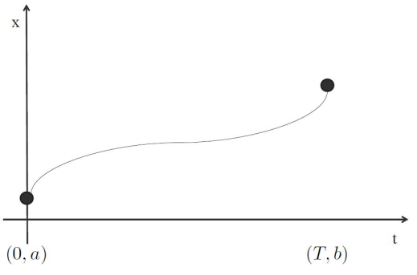
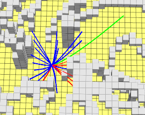

# 问题描述

OBVP 即 optimal bundary value problem，是特殊的 BVP， BVP 问题其实就是解决 state sampled lattice planning 的基本操作方法。

常见的应用案例如：给定初始位置和终点位置，求连接两点的多阶曲线方程。



- 已知边界条件如下

|       | Position | Velocity | Acceleration |
| ----- | -------- | -------- | ------------ |
| t = 0 | a        | 0        | 0            |
| t = T | b        | 0        | 0            |

- 求五次多项式轨迹
  - $x(t)=c_5 t^5 + c_4 t^4 + c_3 t^3 + c_2 t^2 + c_1 t + c_0$

- 求解
  - $\begin{bmatrix} a\\b\\0\\0\\0\\0 \end{bmatrix} = \begin{bmatrix} 0 & 0 & 0 & 0 & 0 & 1 \\ T^5 & T^4 & T^3 & T^2 & T & 1 \\ 0 & 0 & 0 & 0 & 1 & 0 \\ 5T^4 & 4T^3 & 3T^2 & 2T & 1 & 0 \\ 0 & 0 & 0 & 2 & 0 & 0 \\ 20T^3 & 12T^2 & 6T & 2 & 0 & 0\end{bmatrix} \begin{bmatrix} c_5 \\ c_4 \\ c_3 \\ c_2 \\ c_1 \\ c_0 \end{bmatrix}$

那么对于 OBVP 问题，已经有成熟的解法，本文主要说明借助庞特里亚金最小值原理 (Pontryagin's minimum principle) 求解 BVP 问题的方法。

对于如下所示的优化问题：

- $arg\ min \ J=h(s(T))+\int_0^Tg(s(t),u(t))\cdot dt$ 
  - 该优化问题的代价由两部分组成，分别为对最终状态的惩罚项和过程惩罚项
- 写出其 Hamiltonian 和 costate(协变量)
  - $H(s,u,\lambda)=g(s,u)+\lambda^Tf(s,u)$
  - $\lambda$ 为协变量，维数与系统模型 $f(s,u)$ 相关
- 假设最优解
  - $s^*$ ：最优状态
  - $u^*$ ：最优控制（输入）
- 则满足以下最优性条件
  - $s^*(t)=f(s^*(t),u^*(t)),given:s^*(0)=s(0)$
  - $\lambda(t)$ 是微分方程的解
    - $\dot\lambda(t)=-\triangledown_sH(s^*(t),u^*(t),\lambda(t))$
    - $\lambda(T)=-\triangledown h(s^*(T))$
  - 最优控制
    - $u^*(t)=\mathop{\arg\min}\limits_{u(t)}H(s^*(t),u(t),\lambda(t))$

通常求解最优性条件即可得到最优解。但是在处理问题的过程中，会遇到不同的边界条件情况，比如固定边界条件和自由边界条件，下面将分别对这两类问题展开说明，并附上自由边界条件演示示意图

# 固定边界条件

- 建模
  - 目标，最小化时间间隔和加速度
    - $J=\int_0^Tg(x,u)dt=\int_0^T(1+u^TRu)dt=\int_0^T(1+a_x^2+a_y^2+a_z^2)dt$
  - 系统方程
    - $x=(p_x,p_y,p_z,v_x,v_y,v_z)^T$
    - $u=(a_x,a_y,a_z)^T$
    - $\dot{x}=f(x,u)=(v_x,v_y,v_z,a_x,a_y,a_z)^T$
- 求解
  - 协变量 $\lambda=(\lambda_1,\lambda_2,\lambda_3,\lambda_4,\lambda_5,\lambda_6)^T$
  - 定义 Hamiltonian 函数
    - $H(x,u,\lambda)=g(x,u)+\lambda^Tf(x,u)=(1+a_x^2+a_y^2+a_z^2)+\lambda^Tf(x,u)$
    - $\dot{\lambda}=-\triangledown H(x^*,u^*,\lambda)=(0,0,0,-\lambda_1,-\lambda_2,-\lambda_3)^T$
  - 则可以求解出协变量，引入常数 $\alpha,\beta$
    - $\lambda=\begin{bmatrix} 2\alpha_1 \\ 2\alpha_2 \\ 2\alpha_3 \\ -2\alpha_1t-2\beta_1 \\ -2\alpha_2t-2\beta_2 \\ -2\alpha_3t-2\beta_3 \end{bmatrix}$
  - 进一步的可以求解最优输入
    - $u^*=\mathop{\arg\min}\limits_{a(t)}H(x^*(t),u(t),\lambda(t))=\begin{bmatrix} \alpha_1t+\beta_1 \\ \alpha_2t+\beta_2 \\ \alpha_3t+\beta_3 \end{bmatrix}$
  - 那么最优状态（轨迹）如下
    - $x^*=\begin{bmatrix} \frac{1}{6}\alpha_1t^3+\frac{1}{2}\beta_1t^2+v_{x0}t+p_{x0} \\ \frac{1}{6}\alpha_2t^3+\frac{1}{2}\beta_2t^2+v_{y0}t+p_{y0} \\ \frac{1}{6}\alpha_3t^3+\frac{1}{2}\beta_3t^2+v_{z0}t+p_{z0} \\ \frac{1}{2}\alpha_1t^2+\beta_1t+v_{x0} \\ \frac{1}{2}\alpha_2t^2+\beta_2t+v_{y0} \\ \frac{1}{2}\alpha_3t^2+\beta_3t+v_{z0} \end{bmatrix},\ initial\ state:x(0)=\begin{bmatrix} p_{x0} \\ p_{y0} \\ p_{z0} \\ v_{x0} \\ v_{y0} \\ v_{z0} \end{bmatrix}$
  - 根据末状态边界条件可以求解 $\alpha,\beta$
    - $\begin{bmatrix} \frac{1}{6}T^3 & 0 & 0 & \frac{1}{2}T^2 & 0 & 0 \\ 0 & \frac{1}{6}T^3 & 0 & 0 & \frac{1}{2}T^2 & 0 \\ 0 & 0 & \frac{1}{6}T^3 & 0 & 0 & \frac{1}{2}T^2 \\ \frac{1}{2}T^2 & 0 & 0 & T & 0 & 0 \\ 0 & \frac{1}{2}T^2 & 0 & 0 & T & 0 \\ 0 & 0 & \frac{1}{2}T^2 & 0 & 0 & T \end{bmatrix} \begin{bmatrix} \alpha_1 \\ \alpha_2 \\ \alpha_3 \\ \beta_1 \\ \beta_2 \\ \beta_3 \end{bmatrix}=\begin{bmatrix} p_{xf}-p_{x0}-v_{x0}T \\ p_{yf}-p_{y0}-v_{y0}T \\ p_{zf}-p_{z0}-v_{z0}T \\ v_{xf}-v_{x0} \\ v_{yf}-v_{y0} \\ v_{zf}-v_{z0} \end{bmatrix}$
    - $\begin{bmatrix} \alpha_1 \\ \alpha_2 \\ \alpha_3 \\ \beta_1 \\ \beta_2 \\ \beta_3 \end{bmatrix}=\begin{bmatrix} -\frac{12}{T^3} & 0 & 0 & \frac{6}{T^2} & 0 & 0 \\ 0 & -\frac{12}{T^3} & 0 & 0 & \frac{6}{T^2} & 0 \\ 0 & 0 & -\frac{12}{T^3} & 0 & 0 & \frac{6}{T^2} \\ \frac{6}{T^2} & 0 & 0 & -\frac{2}{T} & 0 & 0 \\ 0 & \frac{6}{T^2} & 0 & 0 & -\frac{2}{T} & 0 \\ 0 & 0 & \frac{6}{T^2} & 0 & 0 & -\frac{2}{T} \end{bmatrix}\begin{bmatrix} p_{xf}-p_{x0}-v_{x0}T \\ p_{yf}-p_{y0}-v_{y0}T \\ p_{zf}-p_{z0}-v_{z0}T \\ v_{xf}-v_{x0} \\ v_{yf}-v_{y0} \\ v_{zf}-v_{z0} \end{bmatrix}$
  - 计算代价（最优值）
    - $J=\int_0^T(1+a_x^2+a_y^2+a_z^2)dt$
    - 将求解的最优输入$a=u^*=\begin{bmatrix} \alpha_1t+\beta_1 \\ \alpha_2t+\beta_2 \\ \alpha_3t+\beta_3 \end{bmatrix}$ 带入上式，得到
    - $J=T+(\frac{1}{3}\alpha_1^2T^3+\alpha_1\beta_1T^2+\beta_1^2T)+(\frac{1}{3}\alpha_2^2T^3+\alpha_2\beta_2T^2+\beta_2^2T)+(\frac{1}{3}\alpha_3^2T^3+\alpha_3\beta_3T^2+\beta_3^2T)$ 
  - 最终 $J$ 的只和 $T$ 相关，则可以求出最优的 $T^*=\mathop{\arg\min}\limits_{T}\ J(T)$ ，然后可求出 $\alpha,\beta$，进一步的可以求出 $x^*(t),u^*(t)$ 

# 自由边界条件

在上述求解过程中，我们已知了初始状态 $x_0$ 和末状态 $x_f$ ，但是如果对于末状态，我们只约束位置，而不约束速度，即末状态条件为 $x_f=(p_{xf},p_{yf},p_{zf})^T$，那么上述问题又该如何求解呢？

- 其实在根据末状态边界条件可以求解 $\alpha,\beta$ 之前的操作都是相同的，不在赘述，在求解 $\alpha,\beta$ 时，位置条件不变，仍然如下：

  - $\begin{bmatrix} \frac{1}{6}T^3 & 0 & 0 & \frac{1}{2}T^2 & 0 & 0 \\ 0 & \frac{1}{6}T^3 & 0 & 0 & \frac{1}{2}T^2 & 0 \\ 0 & 0 & \frac{1}{6}T^3 & 0 & 0 & \frac{1}{2}T^2 \end{bmatrix} \begin{bmatrix} \alpha_1 \\ \alpha_2 \\ \alpha_3 \\ \beta_1 \\ \beta_2 \\ \beta_3 \end{bmatrix}=\begin{bmatrix} p_{xf}-p_{x0}-v_{x0}T \\ p_{yf}-p_{y0}-v_{y0}T \\ p_{zf}-p_{z0}-v_{z0}T \end{bmatrix}$ 
  - 现在需要将速度边界条件修改为自由边界条件，此时将用上这个条件 $\lambda(T)=-\triangledown h(s^*(T))$ 
  - 由于代价函数中不存在 $h(s(T))$ 项，所以
    - $\begin{bmatrix} \lambda_4(T) \\ \lambda_5(T) \\ \lambda_6(T) \end{bmatrix}=\begin{bmatrix} -2\alpha_1T-2\beta_1 \\ -2\alpha_2T-2\beta_2 \\ -2\alpha_3T-2\beta_3 \end{bmatrix}=0$
  - 因此总的边界条件如下所示
    - $\begin{bmatrix} \frac{1}{6}T^3 & 0 & 0 & \frac{1}{2}T^2 & 0 & 0 \\ 0 & \frac{1}{6}T^3 & 0 & 0 & \frac{1}{2}T^2 & 0 \\ 0 & 0 & \frac{1}{6}T^3 & 0 & 0 & \frac{1}{2}T^2 \\ T & 0 & 0 & 1 & 0 & 0 \\ 0 & T & 0 & 0 & 1 & 0 \\ 0 & 0 & T & 0 & 0 & 1 \end{bmatrix} \begin{bmatrix} \alpha_1 \\ \alpha_2 \\ \alpha_3 \\ \beta_1 \\ \beta_2 \\ \beta_3 \end{bmatrix}=\begin{bmatrix} p_{xf}-p_{x0}-v_{x0}T \\ p_{yf}-p_{y0}-v_{y0}T \\ p_{zf}-p_{z0}-v_{z0}T \\ 0 \\ 0 \\ 0 \end{bmatrix}$
    - $\begin{bmatrix} \alpha_1 \\ \alpha_2 \\ \alpha_3 \\ \beta_1 \\ \beta_2 \\ \beta_3 \end{bmatrix}=\begin{bmatrix} -\frac{3}{T^3} & 0 & 0 & \frac{3}{2T} & 0 & 0 \\ 0 & -\frac{3}{T^3} & 0 & 0 & \frac{3}{2T} & 0 \\ 0 & 0 & -\frac{3}{T^3} & 0 & 0 & \frac{3}{2T} \\ \frac{3}{T^2} & 0 & 0 & -\frac{1}{2} & 0 & 0 \\ 0 & \frac{3}{T^2} & 0 & 0 & -\frac{1}{2} & 0 \\ 0 & 0 & \frac{3}{T^2} & 0 & 0 & -\frac{1}{2} \end{bmatrix}\begin{bmatrix} p_{xf}-p_{x0}-v_{x0}T \\ p_{yf}-p_{y0}-v_{y0}T \\ p_{zf}-p_{z0}-v_{z0}T \\ 0 \\ 0 \\ 0 \end{bmatrix}$

- 计算代价（最优值）与上述过程一样，这里对最优值进行下深入计算

  - $J=T+(\frac{1}{3}\alpha_1^2T^3+\alpha_1\beta_1T^2+\beta_1^2T)+(\frac{1}{3}\alpha_2^2T^3+\alpha_2\beta_2T^2+\beta_2^2T)+(\frac{1}{3}\alpha_3^2T^3+\alpha_3\beta_3T^2+\beta_3^2T)$ 
  - 由于$\begin{bmatrix} -2\alpha_1T-2\beta_1 \\ -2\alpha_2T-2\beta_2 \\ -2\alpha_3T-2\beta_3 \end{bmatrix}=0$
  - $J=T+\frac{1}{3}\alpha_1^2T^3+\frac{1}{3}\alpha_2^2T^3+\frac{1}{3}\alpha_3^2T^3$ 
  - 记 $\Delta p=p_f-p_0$ ，则有$\begin{bmatrix} \alpha_1 \\ \alpha_2 \\ \alpha_3 \end{bmatrix}=\begin{bmatrix} \frac{-3(\Delta p_x-v_{x0}T)}{T^3} \\ \frac{-3(\Delta p_y-v_{y0}T)}{T^3} \\ \frac{-3(\Delta p_z-v_{z0}T)}{T^3} \end{bmatrix}$
  - 可得 $J=T+\frac{3[(v_{x0}^2+v_{y0}^2+v_{z0}^2)T^2-2(\Delta{p_x}v_{x0}+\Delta{p_y}v_{y0}+\Delta{p_z}v_{z0})T+(\Delta{p_x}^2+\Delta{p_y}^2+\Delta{p_z}^2)]}{T^3}$
  - 记，
    - $a=v_{x0}^2+v_{y0}^2+v_{z0}^2$
    - $b=\Delta{p_x}v_{x0}+\Delta{p_y}v_{y0}+\Delta{p_z}v_{z0}$
    - $c=\Delta{p_x}^2+\Delta{p_y}^2+\Delta{p_z}^2$ 
  - 求 $\frac{\partial{J}}{\partial{T}}=\frac{T^4-3aT^2+12bT-9c}{T^4}=0$ ，即求一元四次方程 $T^4-3aT^2+12bT-9c=0$ 的“正实根”，在c++中可使用“求多项式伴随矩阵特征值”的方法进行求解

- c++代码示例

  ```c++
  // 该函数用于计算三维空间中的 OBVP 问题
  // 输入：起点的位置、速度，终点的位置
  // 计算最优解 T，以及最优值 J
  // 最优解 T 用于计算最优轨迹 (s*(t), u*(t))
  // 最优值 J 用于评估轨迹的总代价
  double OBVPtool::OptimalBVP(Eigen::Vector3d _start_position,
                              Eigen::Vector3d _start_velocity, 
                              Eigen::Vector3d _target_position, 
                              double* _T)
  {
      double optimal_cost = 100000;
      
      Vector3d _delta_pos = _target_position - _start_position;
      // solving T^4 - 3*(vx0^2 + vy0^2 + vz0^2) * T^2 + 12 * (dx * vx0 + dy * vy0 + dz * vz0) * T - 9 * (dx^2 + dy^2 +dz^2)
      double c0 = -9.0 * _delta_pos.squaredNorm();
      double c1 = 12.0 * _delta_pos.dot(_start_velocity);
      double c2 = -3.0 * _start_velocity.squaredNorm();
      double c3 = 0.0;
  
      Matrix<double, 4, 4> matrix_4x4;
      Matrix<complex<double>, Dynamic, Dynamic> matrix_eigenvalues;
      matrix_4x4 << 0, 0, 0, -c0,
          1, 0, 0, -c1,
          0, 1, 0, -c2,
          0, 0, 1, -c3;
      matrix_eigenvalues = matrix_4x4.eigenvalues();
      
      for (int i = 0; i < (int)matrix_eigenvalues.size(); i++)
      {
          double value_imag = imag(matrix_eigenvalues(i));
          double value_real = real(matrix_eigenvalues(i));
          if (std::abs(value_imag) >= 1e-6 || value_real <= 1e-6)
          {
              // costs.emplace_back(optimal_cost);
              continue;
          }
  
          double cost = value_real 
              + 3.0 * _start_velocity.squaredNorm() / value_real 
              - 6.0 * _delta_pos.dot(_start_velocity) / (value_real * value_real) 
              + 3.0 * _delta_pos.squaredNorm() / (value_real * value_real * value_real);
  
          if (cost < optimal_cost)
          {
              optimal_cost = cost;
              *_T = value_real;
          }
      }
  
      return optimal_cost;
  }
  ```

- 运行效果

  

  绿色轨迹表示最优

  蓝色轨迹表示无碰撞但不是最优

  红色轨迹表示有碰撞