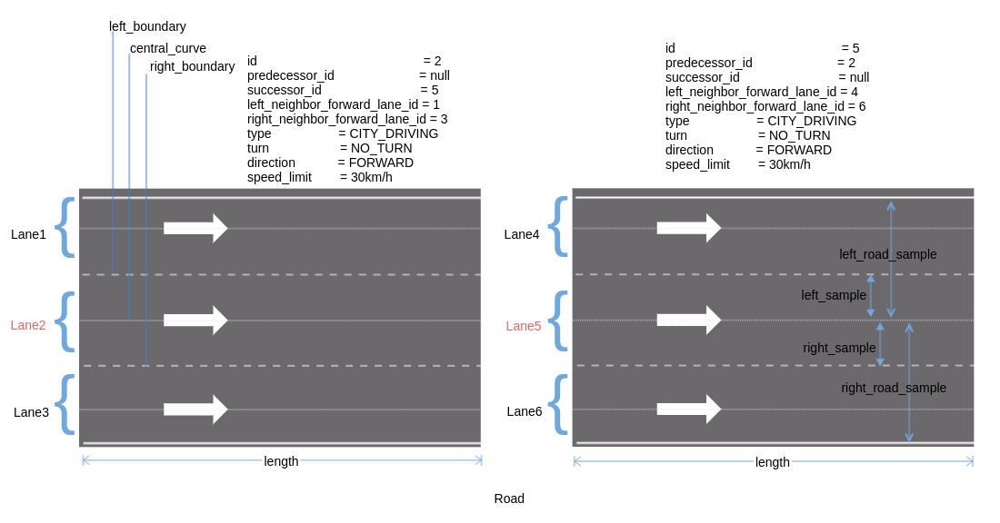

# map模块简介

其实我们只需要知道map模块的主要功能是“加载openstreet格式的地图，并且提供一系列的API给其他模块使用”。然后再根据具体的场景来了解地图各个部分的作用，就算是对map模块比较了解了。

apollo的高精度地图采用了opendrive格式，opendrive是一个统一的地图标准，这样保证了地图的通用性。其中map模块主要提供的功能是读取高精度地图，并且转换成apollo程序中的Map对象。直白一点就是说把xml格式的opendrive高精度地图，读取为程序能够识别的格式。

map模块没有实现的功能是高精度地图的制作，简略的制图过程将在下面章节介绍。

# 地图数据结构
由于openstreet格式是一个标准，可以参考它的官方网站。下面主要介绍下apollo是如何读取xml地图，并且使用的。

地图的读取在 hdmap/adapter中，其中xml_parser目录提供解析xml的能力。而"opendrive_adapter.cc"则实现了地图的加载，转换为程序中的Map对象。然后地图在"hdmap_impl.cc"中提供一系列api接口给其他模块使用。 

下面先介绍下地图消息格式，主要在proto目录。

## Map

"map.proto" 分为地图头部信息和结构体，头部信息主要介绍了地图的基本信息“版本，时间，投影方法，地图大小，厂家等”。结构体主要是道路的不同组成部分，包括“人行横道，路口区域，车道，停车标志，信号灯，让行标志，重叠区域，禁停区域，减速带，道路，停车区域，等”。  

其中有2个交通标志(StopSign，YieldSign)。停车的意思是到路口先停止，看下有没有车，然后再开始启动；让车就是先让行，比如交汇路口，理应让直行的车辆先通过，然后再汇入道路。

overlap指“任何一对在地图上区域有重叠的元素，包括（车道，路口，人行横道）”，比如路口的人行横道和道路是重叠的，还有一些交通标志和道路也是重叠的。 

```protobuf
message Map {
  optional Header header = 1;        //上面所说的地图基本信息

  repeated Crosswalk crosswalk = 2;  //人行横道
  repeated Junction junction = 3;    //交叉路口
  repeated Lane lane = 4;           //车道
  repeated StopSign stop_sign = 5;  //停车标志
  repeated Signal signal = 6;       //信号灯
  repeated YieldSign yield = 7;     //让车标志
  repeated Overlap overlap = 8;     //重叠区域
  repeated ClearArea clear_area = 9;  //禁止停车区域
  repeated SpeedBump speed_bump = 10;  //减速带
  repeated Road road = 11;             //道路
  repeated ParkingSpace parking_space = 12; //停车区域
  repeated PNCJunction pnc_junction = 13;  // todo
  repeated RSU rsu = 14;  // 路边单元，todo
}
```

### Header
首先是地图的基本信息
```protobuf
message Header {
  optional bytes version = 1;   //地图版本
  optional bytes date = 2;      //地图时间
  optional Projection projection = 3; //投影方法
  optional bytes district = 4;        //区
  optional bytes generation = 5;      //
  optional bytes rev_major = 6;       //
  optional bytes rev_minor = 7;       //
  optional double left = 8;           //左
  optional double top = 9;            //上
  optional double right = 10;         //右
  optional double bottom = 11;        //底
  optional bytes vendor = 12;         //供应商
}
```
### Crosswalk
map_crosswalk.proto 人行横道(google图片搜索出了彩虹人行横道和三维人行横道，就问深度学习该怎么办？)  
```protobuf
message Crosswalk {
  optional Id id = 1;        //编号

  optional Polygon polygon = 2;  //区域多边形

  repeated Id overlap_id = 3;   //重叠ID
}
```
  


### Junction
map_junction.proto 路口，道路汇聚点
```protobuf
message Junction {
  optional Id id = 1;    //编号

  optional Polygon polygon = 2;     //多边形

  repeated Id overlap_id = 3;    //重叠id
  enum Type {
    UNKNOWN = 0;
    IN_ROAD = 1;     // 比如2车道变3车道的情况
    CROSS_ROAD = 2;  // 常见的交叉十字路口等
    FORK_ROAD = 3;   // 岔路
    MAIN_SIDE = 4;   // todo
    DEAD_END = 5;    // todo
  };
  optional Type type = 4;
}
```
  


### Lane

map_lane.proto  车道，指可通行区域中的单个车道，包含车道中心线和左、右车道线
```protobuf
message Lane {
  optional Id id = 1;         //编号

  // Central lane as reference trajectory, not necessary to be the geometry central.
  optional Curve central_curve = 2;         //车道中心线

  // Lane boundary curve.
  optional LaneBoundary left_boundary = 3;  //左车道线
  optional LaneBoundary right_boundary = 4; //右车道线

  // in meters.
  optional double length = 5;                //车道长度

  // Speed limit of the lane, in meters per second.
  optional double speed_limit = 6;           //速度限制，m/s

  repeated Id overlap_id = 7;                //重叠区域id

  // All lanes can be driving into (or from).
  repeated Id predecessor_id = 8;  //前任id，可以由多条车道驶入该车道
  repeated Id successor_id = 9;    //后任id，由该车道可以驶向多条车道

  // Neighbor lanes on the same direction.
  repeated Id left_neighbor_forward_lane_id = 10;  //左边同向相邻车道id
  repeated Id right_neighbor_forward_lane_id = 11; //右边同向相邻车道id
  
  //定义车道类型
  enum LaneType {               
    NONE = 1;                   //无
    CITY_DRIVING = 2;           //城市道路
    BIKING = 3;                 //自行车道
    SIDEWALK = 4;               //人行道
    PARKING = 5;                //停车
  };
  optional LaneType type = 12;         //车道类型
  
  // 定义车道转向类型
  enum LaneTurn {
    NO_TURN = 1;        //直行
    LEFT_TURN = 2;      //左转弯
    RIGHT_TURN = 3;     //右转弯
    U_TURN = 4;         //掉头
  };
  optional LaneTurn turn = 13;          //转弯类型

  repeated Id left_neighbor_reverse_lane_id = 14;  //左边反向相邻车道id
  repeated Id right_neighbor_reverse_lane_id = 15; //右边反向相邻车道id

  optional Id junction_id = 16;

  // Association between central point to closest boundary.
  repeated LaneSampleAssociation left_sample = 17; //车道中心线与左车道线之间的距离
  repeated LaneSampleAssociation right_sample = 18;//车道中心线与右车道线之间的距离

  enum LaneDirection {
    FORWARD = 1;     //前
    BACKWARD = 2;    //后，潮汐车道借用的情况？
    BIDIRECTION = 3;  //双向
  }
  optional LaneDirection direction = 19;   //车道方向

  // Association between central point to closest road boundary.
  repeated LaneSampleAssociation left_road_sample = 20; //车道中心线与道路左边界之间的距离
  repeated LaneSampleAssociation right_road_sample = 21;//车道中心线与道路右边界之间的距离
  
  repeated Id self_reverse_lane_id = 22;  // todo
}


// 定义车道线类型，表示坐标 s 处的车道线的类型。此处可以是多种类型，比如某个坐标处既是白实线，又是道路边线
message LaneBoundaryType {
  enum Type {
    UNKNOWN = 0;
    DOTTED_YELLOW = 1;  // 黄虚线
    DOTTED_WHITE = 2;   // 白虚线
    SOLID_YELLOW = 3;   // 黄实线
    SOLID_WHITE = 4;    // 白实线
    DOUBLE_YELLOW = 5;  // 双黄线
    CURB = 6;           // 道路边线
  };
  // Offset relative to the starting point of boundary
  optional double s = 1;
  // support multiple types
  repeated Type types = 2;
}

// 定义车道线，主要由曲线及离散的“车道线类型”构成
message LaneBoundary {
  optional Curve curve = 1;

  optional double length = 2;
  // indicate whether the lane boundary exists in real world
  optional bool virtual = 3;
  // in ascending order of s
  repeated LaneBoundaryType boundary_type = 4;
}

// Association between central point to closest boundary.
message LaneSampleAssociation {
  optional double s = 1;
  optional double width = 2;
}
```
  



### StopSign

map_stop_sign.proto 停车标志
```protobuf
message StopSign {

  optional Id id = 1;         //编号

  repeated Curve stop_line = 2;    //停止线，Curve曲线应该是基础类型

  repeated Id overlap_id = 3;     //重叠id

  enum StopType {
    UNKNOWN = 0;        //未知
    ONE_WAY = 1;        //只有一车道可以停
    TWO_WAY = 2;
    THREE_WAY = 3;
    FOUR_WAY = 4;
    ALL_WAY = 5;
  };
  optional StopType type = 4;
}
```
  


### Signal

map_signal.proto  交通信号灯
```protobuf
// 定义子交通灯
message Subsignal {
  enum Type {
    UNKNOWN = 1;                //未知
    CIRCLE = 2;                 //圆圈
    ARROW_LEFT = 3;             //向左箭头
    ARROW_FORWARD = 4;          //向前箭头
    ARROW_RIGHT = 5;            //向右箭头
    ARROW_LEFT_AND_FORWARD = 6;   //左前箭头
    ARROW_RIGHT_AND_FORWARD = 7;  //右前箭头
    ARROW_U_TURN = 8;             //掉头
  };

  optional Id id = 1;
  optional Type type = 2;

  // Location of the center of the bulb. now no data support.
  optional apollo.common.PointENU location = 3;  //交通灯的中心的世界坐标
}

// 定义补充信息
message SignInfo {
  enum Type {
    None = 0;
    NO_RIGHT_TURN_ON_RED = 1;  //右转不需要等红灯的类型
  };

  optional Type type = 1;
}

// 交通信号灯总是由一组子交通灯组成
message Signal {
  enum Type {
    UNKNOWN = 1;            //未知
    MIX_2_HORIZONTAL = 2;   //2个子交通灯水平分布的类型
    MIX_2_VERTICAL = 3;     //2个子交通灯竖直分布的类型
    MIX_3_HORIZONTAL = 4;   //3个子交通灯水平分布的类型
    MIX_3_VERTICAL = 5;     //3个子交通灯竖直分布的类型
    SINGLE = 6;             //单个交通灯的类型
  };

  optional Id id = 1;
  optional Polygon boundary = 2;     //多边形
  repeated Subsignal subsignal = 3;  //子交通灯
  // TODO: add orientation. now no data support.
  repeated Id overlap_id = 4;  //重叠id
  optional Type type = 5;      //类型
  // stop line
  repeated Curve stop_line = 6;  //该交通信号灯对应的停止线
  
  repeated SignInfo sign_info = 7;  //补充信息
}
```
    


### YieldSign

map_yield_sign.proto    让行标志
```protobuf
message YieldSign {
  optional Id id = 1;       //编号

  repeated Curve stop_line = 2;    //让行标志对应的停车线

  repeated Id overlap_id = 3;     //重叠id
}
```
    


### Overlap

map_overlap.proto  这里只介绍了LaneOverlapInfo，其他的还没有对应的格式
```protobuf
message LaneOverlapInfo {
  optional double start_s = 1;  //position (s-coordinate)
  optional double end_s = 2;    //position (s-coordinate)
  optional bool is_merge = 3;
  
  optional Id region_overlap_id = 4;
}

message RegionOverlapInfo {
  optional Id id = 1;
  repeated Polygon polygon = 2;
}

// Information about one object in the overlap.
message ObjectOverlapInfo {
  optional Id id = 1;

  oneof overlap_info {
    LaneOverlapInfo lane_overlap_info = 3;
    SignalOverlapInfo signal_overlap_info = 4;
    StopSignOverlapInfo stop_sign_overlap_info = 5;
    CrosswalkOverlapInfo crosswalk_overlap_info = 6;
    JunctionOverlapInfo junction_overlap_info = 7;
    YieldOverlapInfo yield_sign_overlap_info = 8;
    ClearAreaOverlapInfo clear_area_overlap_info = 9;
    SpeedBumpOverlapInfo speed_bump_overlap_info = 10;
    ParkingSpaceOverlapInfo parking_space_overlap_info = 11;
    PNCJunctionOverlapInfo pnc_junction_overlap_info = 12;
    RSUOverlapInfo rsu_overlap_info = 13;
  }
}

// Here, the "overlap" includes any pair of objects on the map
// (e.g. lanes, junctions, and crosswalks).
message Overlap {
  optional Id id = 1;

  // Information about one overlap, include all overlapped objects.
  repeated ObjectOverlapInfo object = 2;
  
  repeated RegionOverlapInfo region_overlap = 3;
}
```
> 逻辑概念，没有具体的规则显示这个区域


### ClearArea
map_clear_area.proto  禁止停车区域
```protobuf
// A clear area means in which stopping car is prohibited

message ClearArea {
  optional Id id = 1;            //编号
  repeated Id overlap_id = 2;    //重叠id
  optional Polygon polygon = 3;  //多边形
}
```
  


### SpeedBump

map_speed_bump.proto  减速带

```
message SpeedBump {
    optional Id id = 1;          //编号
    repeated Id overlap_id = 2;   //重叠区域
    repeated Curve position = 3;  //曲线位置
}
```
  


### Road
map_road.proto 道路的信息，由至少一个 RoadSection 组成，而且一旦包含多个 RoadSection，则这些 RoadSection 必须沿着道路的实际顺序排列
```protobuf
message BoundaryEdge {
  optional Curve curve = 1;
  enum Type {
    UNKNOWN = 0;
    NORMAL = 1;
    LEFT_BOUNDARY = 2;   //左边界
    RIGHT_BOUNDARY = 3;  //右边界
  };
  optional Type type = 2;
}

message BoundaryPolygon {
  repeated BoundaryEdge edge = 1;
}

// boundary with holes
message RoadBoundary {
  optional BoundaryPolygon outer_polygon = 1;
  // if boundary without hole, hole is null
  repeated BoundaryPolygon hole = 2;
}

// road section defines a road cross-section, At least one section must be defined in order to
// use a road, If multiple road sections are defined, they must be listed in order along the road
message RoadSection {
  optional Id id = 1;
  // lanes contained in this section
  repeated Id lane_id = 2;
  // boundary of section
  optional RoadBoundary boundary = 3;
}

// The road is a collection of traffic elements, such as lanes, road boundary etc.
// It provides general information about the road.
message Road {
  optional Id id = 1;
  repeated RoadSection section = 2;

  // if lane road not in the junction, junction id is null.
  optional Id junction_id = 3;
  
  enum Type {
    UNKNOWN = 0;
    HIGHWAY = 1;    //高速公路
    CITY_ROAD = 2;  //城市道路
    PARK = 3;       //停车场
  };
  optional Type type = 4;
}
```
    


### ParkingSpace

map_parking.proto  停车区域
```
// ParkingSpace is a place designated to park a car.
message ParkingSpace {
  optional Id id = 1;

  optional Polygon polygon = 2;

  repeated Id overlap_id = 3;

  optional double heading = 4;
}
```
  


### PNCJunction

map_pnc_junction.proto  PNC路口（todo）

```protobuf
message Passage {
  optional Id id = 1;

  repeated Id signal_id = 2;
  repeated Id yield_id = 3;
  repeated Id stop_sign_id = 4;
  repeated Id lane_id = 5;

  enum Type {
    UNKNOWN = 0;
    ENTRANCE = 1;
    EXIT = 2;
  };
  optional Type type = 6;
};

message PassageGroup {
  optional Id id = 1;

  repeated Passage passage = 2;
};

message PNCJunction {
  optional Id id = 1;

  optional Polygon polygon = 2;

  repeated Id overlap_id = 3;
  
  repeated PassageGroup passage_group = 4;
}
```


### RSU

map_rsu.proto  路边单元（垃圾箱之类的？）todo
```protobuf
message RSU {
  optional Id id = 1;
  optional Id junction_id = 2;
  repeated Id overlap_id = 3;
};
```


### 其他  

map_id.proto  基本数据类型
```protobuf
message Id {
  optional string id = 1;     //id，字符类型
}
```


map_geometry.proto  基本数据类型，定义地图元素所需要的几何结构
```protobuf
// Polygon, not necessary convex.
message Polygon {
  repeated apollo.common.PointENU point = 1;
}

// Straight line segment.
message LineSegment {
  repeated apollo.common.PointENU point = 1;
}

// Generalization of a line.
message CurveSegment {
  oneof curve_type {
    LineSegment line_segment = 1;
  }
  optional double s = 6;  // start position (s-coordinate)
  optional apollo.common.PointENU start_position = 7;
  optional double heading = 8;  // start orientation
  optional double length = 9;
}

// An object similar to a line but that need not be straight.
message Curve {
  repeated CurveSegment segment = 1;
}
```

map_speed_control.proto  限制速度，辅助数据类型

```protobuf
// This proto defines the format of an auxiliary file that helps to
// define the speed limit on certain area of road.
// Apollo can use this file to quickly fix speed problems on maps,
// instead of waiting for updating map data.
message SpeedControl {
  optional string name = 1;
  optional apollo.hdmap.Polygon polygon = 2;
  optional double speed_limit = 3;
}

message SpeedControls {
  repeated SpeedControl speed_control = 1;
}
```


## opendriver地图解析

上面只是简单的介绍了下地图的数据格式，具体的应用场景，还需要结合planning模块进一步学习。  
我们再回过头来看adapter模块，其中xml_parser就是针对道路的不同元素部分做的解析。
```
├── adapter
│   ├── BUILD
│   ├── coordinate_convert_tool.cc    // 坐标转换工具
│   ├── coordinate_convert_tool.h
│   ├── opendrive_adapter.cc          // 加载opendrive格式地图
│   ├── opendrive_adapter.h
│   ├── proto_organizer.cc            // 
│   ├── proto_organizer.h
│   └── xml_parser          // xml_parser针对道路的不同元素做相应解析
│       ├── common_define.h
│       ├── header_xml_parser.cc
│       ├── header_xml_parser.h
│       ├── junctions_xml_parser.cc
│       ├── junctions_xml_parser.h
│       ├── lanes_xml_parser.cc
│       ├── lanes_xml_parser.h
│       ├── objects_xml_parser.cc
│       ├── objects_xml_parser.h
│       ├── roads_xml_parser.cc
│       ├── roads_xml_parser.h
│       ├── signals_xml_parser.cc
│       ├── signals_xml_parser.h
│       ├── status.h
│       ├── util_xml_parser.cc
│       └── util_xml_parser.h
```
<a name="api" />

## 高精度地图API
最后在看下hdmap_impl.cc，主要实现了一系列的api来查找道路中的元素。由于实现的接口太多，后面有时间了看是否能够整理下api文档。  
关于pnc_map和relative_map还没有介绍，关于一些道路元素的使用场景没有介绍。  


<a name="tools" />

## tools
tools的目录结构如下，主要是一些制作和转换地图的工具。  
```
.
├── BUILD
├── bin_map_generator.cc    // txt地图转换为bin地图
├── map_datachecker         // 远程地图采集，这里只是采集了pose？
├── map_tool.cc             // 地图加上偏移
├── map_xysl.cc             // 功能很多，用来查找lane，以及lane上的点转SL
├── proto_map_generator.cc  // 转换opendrive格式的地图为apollo proto的地图
├── quaternion_euler.cc     // 4维旋转转3维旋转
├── refresh_default_end_way_point.cc  // 更新routing的默认地标
└── sim_map_generator.cc  // 生成sim map
```

下面简单介绍下各个工具的实现以及作用。  


#### sim_map_generator
通过base_map生成sim_map，其中sim_map去掉了base_map中的
```
left_sample
right_sample
left_road_sample
right_road_sample
```
主要的作用为获取当前道路的宽度。  

另外对`central_curve`,`left_boundary`和`right_boundary`进行了降采样，减少了点数。  


#### refresh_default_end_way_point
更新routing POI中的默认点的位置信息，这里的默认点就是比较典型的地标，方便选择routing位置。  

#### quaternion_euler
4维旋转转3维

#### proto_map_generator
转换opendrive格式的地图为apollo proto的地图

#### map_xysl
功能很多，用来查找lane，以及lane上的点转SL  

#### map_tool
地图整体加上位置偏移。  

#### bin_map_generator
txt地图转换为bin地图。  


<a name="how"/>

## 如何制作高精度地图
前面介绍了为什么需要高精度地图，那么我们如何制作一张高精度地图呢？  
制作一张高精度地图可以大概分为3个过程：采集、加工、转换。

<a name="collect"/>

#### 采集
如何采集地图？  

我们需要需要一些传感器来获取数据，下面是需要的传感器列表：
1. lidar
2. 摄像头
3. gnss
4. imu  

  
* **lidar** 主要是来采集点云数据，因为激光雷达可以精确的反应出位置信息，所以激光雷达可以知道路面的宽度，红绿灯的高度，以及一些其他的信息，当然现在也有厂家基于视觉SLAM（纯摄像头测距）来制作地图的，有兴趣的也可以看下相关介绍。  
* **摄像头** 主要是来采集一些路面的标志，车道线等，因为图像的像素信息更多，而位置信息不太精确，所以采用摄像头来识别车道线，路面的一些标志等。  
* **gnss** 记录了车辆的位置信息，记录了当前采集点的坐标。  
* **imu** 用来捕获车辆的角度和加速度信息，用来校正车辆的位置和角度。  

需要的操作系统和软件：  
* ubuntu 16.04
* apollo  
用apollo的录制bag功能，可以把传感器的数据都录制下来，提供生成高精地图的原始数据。其实在录制数据之前，需要对上面所说的传感器进行校准工作，这部分的工作比较专业，涉及到坐标系转换，也涉及到一些传感器的知识，所以对非专业人士来说不是那么好理解。或者开发一系列工具来实现校准。  
接下来就是采集了，采集过程中需要多次采集来保证采集的数据比较完整，比如你在路口的时候，从不同的角度开车过去看到的建筑物的轮廓是不一样的，这些轮廓就是激光雷达扫描到的数据。所以遇到路口，或者多车道的情况，尽可能的多采集几次，才能收集到比较完整的地图信息。并且速度不要太快，apollo上的介绍是不超过60km/h（这里没有特别说明会出现什么问题）。  
以下是我的一点个人想法：  
> 上面的采集方案依赖很多，首先需要一系列的硬件，其次是需要apollo，并且熟悉apollo的启动流程，最后还需要传感器校准的知识。实际上采集的过程中我们不需要自动驾驶。可以开发一个轻量级的采集方案，硬件全部集中到一个盒子中，软件只需要提供录制bag包的能力就可以了，这点ros都可以做到，最后校准由于硬件都是一体化的盒子，只需要校准一个传感器就可以把其中所有传感器的坐标系确定。相对于上面的方案来说更加轻量，可能只需要邮寄一套设备就可以开始录制地图了。  
here的地图是分层的，比如路面是很少更新的，而路灯，车道标识，或者红绿灯可能会更换，所以路面信息可能需要激光雷达去采集一次，而路灯，车道标识，红绿灯等可以通过摄像头的方案来更新，因为高精度地图需要实时更新，上面的方案可能更加适合一些地图更新的场景。


<a name="process"/>

#### 加工
如何加工上述地图？  

首先需要生成一张原始的地图，这里我们采用点云生成原始的地图，因为点云的距离位置信息比较准确，因为点云数据是0.1s采集一帧，下面我们可以做一个计算。如果车速是100km/h，对应27.8m/s。即0.1s车行驶的距离是2.78m，而激光雷达的扫描距离大概是150m，所以前后2帧大部分地方是重合的。因为数据是一帧一帧的，我们需要把上面的说的每一帧进行合并，生成一张完整的地图，有点类似全景照片拼接，这样我们就可以得到一张原始的采集路段的地图。这里用到了点云的配准技术，有2种算法ICP和NDT，基于上面的算法，可以把点云的姿态进行变换并且融合。具体的介绍可以[参考](https://blog.csdn.net/xs1997/article/details/76795041)。
  
上图红色和绿色的部分是从不同方位扫描得到的结果，最后是配准融合之后的结果，可以把地球想象成上图这个模型放大了1000万倍的效果，我们的车相当于一个扫描设备，把每次扫描的结果拼接起来，就制作好了一张点云地图。  
点云拼接好了之后，我们就需要在道路上标出路沿，车道线，红绿灯，路口，一些交通标识等。大部分的工作都可以用深度学习结合图像的方法去解决，查找出上面的一些信息并且标识出来，目前有些场景还是需要人工标识出来，比如路口停止线和红绿灯的关系，如果一些特殊场景的车道线等，需要人工去做一些校正。  
上面的过程可以说是一个简易的制图过程。实际上这里还需要讲下高精地图的格式，因为如果没有一个统一的格式，高精度地图是没有太多意义的。我们可以把高精度地图分为三层:  
* **地图图层** 地图图层主要是道路的信息，比如道路的路沿，车道线，路口信息，主要是道路的一些基本信息。
* **定位图层** 定位图层主要是具备独特的目标或特征，比如红绿灯，交通标志，道路的点云数据等。
* **动态图层** 动态图层主要是一些实时路况，修路或者封路等需要实时推送或者更新的数据。
通过下面的加工流程：  
```
点云地图校准 -> 地图标注加工 -> 高精度地图
```
这样就生成了一张高精度地图，当然加工过程中首要的目标是提高效率和质量，尽量的采用算法自动化处理会很大的提高效率，这可能是后面地图厂家的核心竞争力。因为地图需要实时更新，谁的效率更高，谁的图就越新，用的人越多，之后的数据也越完善。  


<a name="transform"/>

#### 转换
转换主要是得到一个通用的自动驾驶系统可以使用的高精度地图。  

上面的高精地图格式可能还是原始的数据格式，需要转换为apollo中高精度地图的格式，apollo中高精度地图采用了opendrive的格式，并且做了改进，总之这是一个通用的标准，这个很重要，否则每个厂家的数据如果不兼容，会导致很大的问题，你需要开发一系列的转换工具，去处理不同地图的差异，并且不同的自动驾驶系统和不同的地图厂家采用的方式不一样，会带来很多兼容性问题。  

<a name="reference" />

## Reference
[convert opendrive to base_map.xml](https://github.com/ApolloAuto/apollo/issues/603)
[点云拼接注册](https://blog.csdn.net/xs1997/article/details/76795041)  
[百度技术讲堂](http://bit.baidu.com/Course/detail/id/282.html)  
[四维图新](https://www.navinfo.com/product/autodri_map)  
[Apollo 2.5地图采集功能使用指南](https://link.zhihu.com/?target=https%3A//github.com/ApolloAuto/apollo/blob/master/docs/quickstart/apollo_2_5_map_collection_guide_cn.md)

