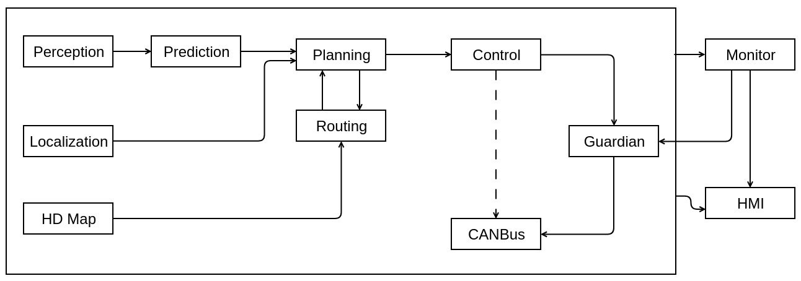

Dig into Apollo - Planning 

> 吾尝终日而思矣 不如须臾之所学也


# Planning的输入输出
通常我们讲，自动驾驶根据自车状态和周边环境的信息进行规划，然后将规划结果交给控制模块执行。很容易理解规划模块的输入应该是自车状态和周边环境，输出应该是规划出的可执行轨迹，但是，往更深的层面挖掘，自车状态和周边环境具体包括哪些物理信息，这些物理信息又该如何分类，如何用程序语言描述，另外可执行轨迹又该如何设计，这貌似是个非常细节、严谨的环节，那么我们来看看 Apollo 是如何处理的，随笔记录一下，分享给大家。

我们先看下Apollo的数据流向：​​​


可以看到规划(planning)模块的上游是Localization, Prediction, Routing模块，而下游是Control模块。Routing模块先规划出一条导航线路，然后Planning模块根据这条线路做局部优化，如果Planning模块发现短期规划的线路行不通（比如前面修路，或者错过了路口），会触发Routing模块重新规划线路，因此这两个模块的数据流是双向的。
Planning模块的输入在"planning_component.h"中，接口如下：

```c++
  bool Proc(const std::shared_ptr<prediction::PredictionObstacles>&
                prediction_obstacles,
            const std::shared_ptr<canbus::Chassis>& chassis,
            const std::shared_ptr<localization::LocalizationEstimate>&
                localization_estimate) override;
```
输入参数为:
1. 预测的障碍物信息(prediction_obstacles)
2. 车辆底盘(chassis)信息(车辆的速度，加速度，航向角等信息)
3. 车辆当前位置(localization_estimate)
> 实际上还有高精度地图信息，不在参数中传入，而是在函数中直接读取的。  

另外，在"planning_component.h"中还定义了一系列 reader，用于读取目标 topic 中的信息，如下所示：

```c++
 private:
  std::shared_ptr<cyber::Reader<perception::TrafficLightDetection>>
      traffic_light_reader_;
  std::shared_ptr<cyber::Reader<routing::RoutingResponse>> routing_reader_;
  std::shared_ptr<cyber::Reader<planning::PadMessage>> pad_msg_reader_;
  std::shared_ptr<cyber::Reader<relative_map::MapMsg>> relative_map_reader_;
  std::shared_ptr<cyber::Reader<storytelling::Stories>> story_telling_reader_;
```

这些信息被读取后最终会整合至 `LocalView local_view_;` 中，其为一个结构体，包含了规划所需要的全部输入信息，如下所示：

```c++
/**
 * @struct local_view
 * @brief LocalView contains all necessary data as planning input
 */

struct LocalView {
  std::shared_ptr<prediction::PredictionObstacles> prediction_obstacles;
  std::shared_ptr<canbus::Chassis> chassis;
  std::shared_ptr<localization::LocalizationEstimate> localization_estimate;
  std::shared_ptr<perception::TrafficLightDetection> traffic_light;
  std::shared_ptr<routing::RoutingResponse> routing;
  std::shared_ptr<relative_map::MapMsg> relative_map;
  std::shared_ptr<PadMessage> pad_msg;
  std::shared_ptr<storytelling::Stories> stories;
};
```

Planning模块的输出结果主要包含3个，如下所示：

```c++
  std::shared_ptr<cyber::Writer<ADCTrajectory>> planning_writer_;
  std::shared_ptr<cyber::Writer<routing::RoutingRequest>> rerouting_writer_;
  std::shared_ptr<cyber::Writer<PlanningLearningData>>
      planning_learning_data_writer_;
```

下面针对以上数据结构分别展开分析，Apollo 中采用了 Protobuf ，其文件格式是 .proto，在编译时会生成对应的 .h 和 .cpp 文件，包含一些默认的函数接口，主要是用来存取数据的，没有其他的逻辑运算。

## PredictionObstacles

这部分为障碍物信息，障碍物信息源于 perception 模块，其输出的 PerceptionObstacles 作为 prediction 模块的输入，经过加工处理，丰富了障碍物的预测信息，然后输出至 planning 模块。

### PerceptionObstacle

注意区分 PerceptionObstacle 和 PerceptionObstacles，Apollo 中未加 s 的消息格式通常是基本的结构，表征单体，加了 s 的消息格式通常是单体的集合，可以由任意个单体构成，另外会有额外的补充信息。

这里暂且只关注 PerceptionObstacle，是由 perception 模块生成的消息类型，其包含了单体障碍物的全部信息，其中可能包含一些预留信息，如下所示：

```protobuf
message PerceptionObstacle {
  optional int32 id = 1;  // obstacle ID.

  // obstacle position in the world coordinate system.
  optional apollo.common.Point3D position = 2;

  optional double theta = 3;  // heading in the world coordinate system.
  optional apollo.common.Point3D velocity = 4;  // obstacle velocity.

  // Size of obstacle bounding box.
  optional double length = 5;  // obstacle length.
  optional double width = 6;   // obstacle width.
  optional double height = 7;  // obstacle height.

  repeated apollo.common.Point3D polygon_point = 8;  // obstacle corner points.

  // duration of an obstacle since detection in s.
  optional double tracking_time = 9;

  enum Type {
    UNKNOWN = 0;
    UNKNOWN_MOVABLE = 1;
    UNKNOWN_UNMOVABLE = 2;
    PEDESTRIAN = 3;  // Pedestrian, usually determined by moving behavior.
    BICYCLE = 4;     // bike, motor bike
    VEHICLE = 5;     // Passenger car or truck.
  };
  optional Type type = 10;         // obstacle type
  optional double timestamp = 11;  // GPS time in seconds.

  // Just for offline debugging, will not fill this field on board.
  // Format: [x0, y0, z0, x1, y1, z1...]
  repeated double point_cloud = 12 [packed = true];

  optional double confidence = 13 [deprecated = true];
  enum ConfidenceType {
    CONFIDENCE_UNKNOWN = 0;
    CONFIDENCE_CNN = 1;
    CONFIDENCE_RADAR = 2;
  };
  optional ConfidenceType confidence_type = 14 [deprecated = true];
  // trajectory of object.
  repeated apollo.common.Point3D drops = 15 [deprecated = true];

  // The following fields are new added in Apollo 4.0
  optional apollo.common.Point3D acceleration = 16;  // obstacle acceleration

  // a stable obstacle point in the world coordinate system
  // position defined above is the obstacle bounding box ground center
  optional apollo.common.Point3D anchor_point = 17;  // 这个点的物理意义？	
  optional BBox2D bbox2d = 18;

  enum SubType {
    ST_UNKNOWN = 0;
    ST_UNKNOWN_MOVABLE = 1;
    ST_UNKNOWN_UNMOVABLE = 2;
    ST_CAR = 3;
    ST_VAN = 4;
    ST_TRUCK = 5;
    ST_BUS = 6;
    ST_CYCLIST = 7;
    ST_MOTORCYCLIST = 8;
    ST_TRICYCLIST = 9;
    ST_PEDESTRIAN = 10;
    ST_TRAFFICCONE = 11;
  };
  optional SubType sub_type = 19;  // obstacle sub_type

  repeated SensorMeasurement measurements = 20;  // sensor measurements

  // orthogonal distance between obstacle lowest point and ground plane
  optional double height_above_ground = 21 [default = nan];

  // position covariance which is a row-majored 3x3 matrix
  repeated double position_covariance = 22 [packed = true];  // 协方差矩阵，以行为主，3*3
  // velocity covariance which is a row-majored 3x3 matrix
  repeated double velocity_covariance = 23 [packed = true];
  // acceleration covariance which is a row-majored 3x3 matrix
  repeated double acceleration_covariance = 24 [packed = true];

  // lights of vehicles
  optional LightStatus light_status = 25;

  // Debug Message
  optional DebugMessage msg = 26;

  enum Source {
    HOST_VEHICLE = 0;
    V2X = 1;
  };

  optional Source source = 27 [default = HOST_VEHICLE];
  optional V2XInformation v2x_info = 28;
}
```

其中，SensorMeasurement 表示观测到该障碍物的所有传感器的测量信息，其消息格式如下：

```protobuf
message SensorMeasurement {
  optional string sensor_id = 1;
  optional int32 id = 2;

  optional apollo.common.Point3D position = 3;
  optional double theta = 4;
  optional double length = 5;
  optional double width = 6;
  optional double height = 7;

  optional apollo.common.Point3D velocity = 8;

  optional PerceptionObstacle.Type type = 9;
  optional PerceptionObstacle.SubType sub_type = 10;
  optional double timestamp = 11;
  optional BBox2D box = 12;  // only for camera measurements
}
```

BBox2D 表示在相机视图上包络障碍物的矩形框，其消息格式如下：

```protobuf
message BBox2D {
  optional double xmin = 1;  // in pixels.
  optional double ymin = 2;  // in pixels.
  optional double xmax = 3;  // in pixels.
  optional double ymax = 4;  // in pixels.
}
```

LightStatus 表示障碍物的刹车灯和转向灯信息，其消息格式如下：

```protobuf
message LightStatus {
  optional double brake_visible = 1;
  optional double brake_switch_on = 2;
  optional double left_turn_visible = 3;
  optional double left_turn_switch_on = 4;
  optional double right_turn_visible = 5;
  optional double right_turn_switch_on = 6;
}
```

DebugMessage 表示障碍物的轨迹，此处应该是观测轨迹，不包含预测信息，其消息格式如下：

```protobuf
message DebugMessage {
  // can have multiple trajectories per obstacle
  repeated Trajectory trajectory = 1;
}
```

V2XInformation 的消息格式如下：

```protobuf
message V2XInformation {
  enum V2XType {
    NONE = 0;
    ZOMBIES_CAR = 1;
    BLIND_ZONE = 2;
  };
  repeated V2XType v2x_type = 1;
}
```

### PredictionObstacle

注意此处未加 s，为经过 prediction 模块加工后的障碍物信息，增加了预测周期、障碍物轨迹、障碍物意图、历史特征序列等信息，具体如下所示：

``` protobuf
message PredictionObstacle {
  optional apollo.perception.PerceptionObstacle perception_obstacle = 1;
  optional double timestamp = 2;  // GPS time in seconds
  // the length of the time for this prediction (e.g. 10s)
  optional double predicted_period = 3;
  // can have multiple trajectories per obstacle
  repeated Trajectory trajectory = 4;

  // estimated obstacle intent
  optional ObstacleIntent intent = 5;

  optional ObstaclePriority priority = 6;

  optional bool is_static = 7 [default = false];

  // Feature history latest -> earliest sequence
  repeated Feature feature = 8;
}
```

其中 ObstacleIntent 表示估计的障碍物的意图，具体如下所示：

```protobuf
// estimated obstacle intent
message ObstacleIntent {
  enum Type {
    UNKNOWN = 0;
    STOP = 1;
    STATIONARY = 2;
    MOVING = 3;
    CHANGE_LANE = 4;
    LOW_ACCELERATION = 5;
    HIGH_ACCELERATION = 6;
    LOW_DECELERATION = 7;
    HIGH_DECELERATION = 8;
  }
  optional Type type = 1 [default = UNKNOWN];
}
```

Feature 表示障碍物的特征，其修饰符为 repeated，表明对于同一障碍物，存储了历史特征，个人感觉这个 Feature 类型的消息涵盖了 PerceptionObstacle 的信息，但是这两者在 PredictionObstacle 中是共存的，不知道是否冗余，Feature 消息的具体格式如下：

```protobuf
message Feature {
  // Obstacle ID
  optional int32 id = 1;

  // Obstacle features
  repeated apollo.common.Point3D polygon_point = 30;
  optional apollo.common.Point3D position = 2;
  optional apollo.common.Point3D front_position = 27;
  optional apollo.common.Point3D velocity = 3;
  optional apollo.common.Point3D raw_velocity = 28;  // from perception
  optional apollo.common.Point3D acceleration = 4;
  optional double velocity_heading = 5;
  optional double speed = 6;
  optional double acc = 7;
  optional double theta = 8;
  optional double length = 9;
  optional double width = 10;
  optional double height = 11;
  optional double tracking_time = 12;
  optional double timestamp = 13;

  // Obstacle type-specific features
  optional Lane lane = 14;
  optional JunctionFeature junction_feature = 26;

  // Obstacle tracked features
  optional apollo.common.Point3D t_position = 16;
  optional apollo.common.Point3D t_velocity = 17 [deprecated = true];
  optional double t_velocity_heading = 18 [deprecated = true];
  optional double t_speed = 19 [deprecated = true];
  optional apollo.common.Point3D t_acceleration = 20 [deprecated = true];
  optional double t_acc = 21 [deprecated = true];

  optional bool is_still = 22 [default = false];
  optional apollo.perception.PerceptionObstacle.Type type = 23;
  optional double label_update_time_delta = 24;

  optional ObstaclePriority priority = 25;

  optional bool is_near_junction = 29 [default = false];

  // Obstacle ground-truth labels:
  repeated PredictionTrajectoryPoint future_trajectory_points = 31;

  // Obstacle short-term predicted trajectory points
  repeated apollo.common.TrajectoryPoint
      short_term_predicted_trajectory_points = 32;

  // Obstacle predicted trajectories
  repeated Trajectory predicted_trajectory = 33;

  // ADC trajectory at the same frame
  repeated apollo.common.TrajectoryPoint adc_trajectory_point = 34;

  // Surrounding lanes
  repeated string surrounding_lane_id = 35;
  repeated string within_lane_id = 36;
}
```

### PredictionObstacles

前面做的两种消息类型的铺垫，是为了引出最后这种 PredictionObstacles 消息类型，根据其命名规则就很容易想到它是 PredictionObstacle 的复数形式，也就是说包含了当前帧中所有的障碍物信息，当然也可能是0个（没有障碍物），先看其消息格式：

```protobuf
message PredictionObstacles {
  // timestamp is included in header
  optional apollo.common.Header header = 1;

  // make prediction for multiple obstacles
  repeated PredictionObstacle prediction_obstacle = 2;

  // perception error code
  optional apollo.common.ErrorCode perception_error_code = 3;

  // start timestamp
  optional double start_timestamp = 4;

  // end timestamp
  optional double end_timestamp = 5;

  // self driving car intent
  optional Intent intent = 6;

  // Scenario
  optional Scenario scenario = 7;
}
```

其中，ErrorCode 的信息如下：

```protobuf
// Error codes enum for API's categorized by modules.
enum ErrorCode {
  // No error, returns on success.
  OK = 0;

  // Control module error codes start from here.
  CONTROL_ERROR = 1000;
  CONTROL_INIT_ERROR = 1001;
  CONTROL_COMPUTE_ERROR = 1002;
  CONTROL_ESTOP_ERROR = 1003;
  PERFECT_CONTROL_ERROR = 1004;

  // Canbus module error codes start from here.
  CANBUS_ERROR = 2000;
  CAN_CLIENT_ERROR_BASE = 2100;
  CAN_CLIENT_ERROR_OPEN_DEVICE_FAILED = 2101;
  CAN_CLIENT_ERROR_FRAME_NUM = 2102;
  CAN_CLIENT_ERROR_SEND_FAILED = 2103;
  CAN_CLIENT_ERROR_RECV_FAILED = 2104;

  // Localization module error codes start from here.
  LOCALIZATION_ERROR = 3000;
  LOCALIZATION_ERROR_MSG = 3100;
  LOCALIZATION_ERROR_LIDAR = 3200;
  LOCALIZATION_ERROR_INTEG = 3300;
  LOCALIZATION_ERROR_GNSS = 3400;

  // Perception module error codes start from here.
  PERCEPTION_ERROR = 4000;
  PERCEPTION_ERROR_TF = 4001;
  PERCEPTION_ERROR_PROCESS = 4002;
  PERCEPTION_FATAL = 4003;
  PERCEPTION_ERROR_NONE = 4004;
  PERCEPTION_ERROR_UNKNOWN = 4005;

  // Prediction module error codes start from here.
  PREDICTION_ERROR = 5000;

  // Planning module error codes start from here
  PLANNING_ERROR = 6000;
  PLANNING_ERROR_NOT_READY = 6001;

  // HDMap module error codes start from here
  HDMAP_DATA_ERROR = 7000;

  // Routing module error codes
  ROUTING_ERROR = 8000;
  ROUTING_ERROR_REQUEST = 8001;
  ROUTING_ERROR_RESPONSE = 8002;
  ROUTING_ERROR_NOT_READY = 8003;

  // Indicates an input has been exhausted.
  END_OF_INPUT = 9000;

  // HTTP request error codes.
  HTTP_LOGIC_ERROR = 10000;
  HTTP_RUNTIME_ERROR = 10001;

  // Relative Map error codes.
  RELATIVE_MAP_ERROR = 11000;  // general relative map error code
  RELATIVE_MAP_NOT_READY = 11001;

  // Driver error codes.
  DRIVER_ERROR_GNSS = 12000;
  DRIVER_ERROR_VELODYNE = 13000;

  // Storytelling error codes.
  STORYTELLING_ERROR = 14000;
}
```

Intent 表示自车的意图，如下：

```protobuf
// self driving car intent
message Intent {
  enum Type {
    UNKNOWN = 0;
    STOP = 1;
    CRUISE = 2;
    CHANGE_LANE = 3;
  }
  optional Type type = 1 [default = UNKNOWN];
}
```

Scenario 表示场景，如下：

```protobuf
message Scenario {
  enum Type {
    UNKNOWN = 0;
    CRUISE = 1000;
    CRUISE_URBAN = 1001;
    CRUISE_HIGHWAY = 1002;
    JUNCTION = 2000;
    JUNCTION_TRAFFIC_LIGHT = 2001;
    JUNCTION_STOP_SIGN = 2002;
  }
  optional Type type = 1 [default = UNKNOWN];
  optional string junction_id = 2;
}
```

至此，planning 模块的输入之一 PredictionObstacles 的消息类型分析完毕，下面分析同样来自 perception 模块的 TraficLightDetection。

## TraficLightDetection

这个消息类型比 PredictionObstacles 要简单的多，主要为交通灯的信息，如下所示：

```protobuf
message TrafficLightDetection {
  optional apollo.common.Header header = 2;
  repeated TrafficLight traffic_light = 1;
  optional TrafficLightDebug traffic_light_debug = 3;
  optional bool contain_lights = 4;
  enum CameraID {
    CAMERA_FRONT_LONG = 0;
    CAMERA_FRONT_NARROW = 1;
    CAMERA_FRONT_SHORT = 2;
    CAMERA_FRONT_WIDE = 3;
  };
  optional CameraID camera_id = 5;
}
```

其中 TrafficLight 表示交通灯的基本信息，其中包括交通灯的颜色、可信度、已经跟踪的时间、是否闪烁以及剩余时间（通过v2x才能获取的信息），==但是个人感觉还应该补充交通灯的 type，以区分信号灯和信号指示灯，或许在其他地方有体现，暂时保留该意见==，如下所示：

```protobuf
message TrafficLight {
  enum Color {
    UNKNOWN = 0;
    RED = 1;
    YELLOW = 2;
    GREEN = 3;
    BLACK = 4;
  };
  optional Color color = 1;

  // Traffic light string-ID in the map data.
  optional string id = 2;

  // How confidence about the detected results, between 0 and 1.
  optional double confidence = 3 [default = 1.0];

  // Duration of the traffic light since detected.
  optional double tracking_time = 4;

  // Is traffic blinking
  optional bool blink = 5;

  // v2x traffic light remaining time.
  optional double remaining_time = 6;
}
```

另外 TrafficLightDebug 看起来好像是图片处理的过程信息，这个地方暂时保留，其信息如下：

```protobuf
message TrafficLightDebug {
  optional TrafficLightBox cropbox = 1;
  repeated TrafficLightBox box = 2;
  optional int32 signal_num = 3;
  optional int32 valid_pos = 4;
  optional double ts_diff_pos = 5;
  optional double ts_diff_sys = 6;
  optional int32 project_error = 7;
  optional double distance_to_stop_line = 8;
  optional int32 camera_id = 9 [deprecated = true];
  repeated TrafficLightBox crop_roi = 10;  // roi: region of interest
  repeated TrafficLightBox projected_roi = 11;
  repeated TrafficLightBox rectified_roi = 12;
  repeated TrafficLightBox debug_roi = 13;
}
```

其中，TrafficLightBox 表示一个框框，这个框框的信息如下所示：

```protobuf
message TrafficLightBox {
  optional int32 x = 1;
  optional int32 y = 2;
  optional int32 width = 3;
  optional int32 height = 4;
  optional TrafficLight.Color color = 5;
  optional bool selected = 6;
  optional string camera_name = 7;
}
```

至此，TraficLightDetection 的分析完毕。

## Stories

Stories 的作用是，描述自车相对于道路特征的位置信息，比如到路口的距离、到信号灯的距离、到交通标识牌的距离，在规划模块中有助于 scenario 判断或者某个 scenario 中 stage 之间的切换，其消息格式如下：

```protobuf
// Usage guide for action modules:
// 1. Call `stories.has_XXX()` to check if a story you are interested is in
//    charge.
// 2. Access the story details if necessary, and take action accordingly.
message Stories {
  optional apollo.common.Header header = 1;

  optional CloseToClearArea close_to_clear_area = 2;
  optional CloseToCrosswalk close_to_crosswalk = 3;
  optional CloseToJunction close_to_junction = 4;
  optional CloseToSignal close_to_signal = 5;
  optional CloseToStopSign close_to_stop_sign = 6;
  optional CloseToYieldSign close_to_yield_sign = 7;
}
```

其中 CloseToClearArea 没能理解其 clear area 代表的含义，

```protobuf
message CloseToClearArea {
  optional string id = 1;
  optional double distance = 2 [default = nan];
}
```

CloseToCrosswalk 表示在接近人行横道，

```protobuf
message CloseToCrosswalk {
  optional string id = 1;
  optional double distance = 2 [default = nan];
}
```

CloseToJunction 表示在接近路口，

```protobuf
message CloseToJunction {
  enum JunctionType {
    PNC_JUNCTION = 1;
    JUNCTION = 2;
  };
  optional string id = 1;
  optional JunctionType type = 2;
  optional double distance = 3 [default = nan];
}
```

CloseToSignal 表示在接近信号灯，

```protobuf
message CloseToSignal {
  optional string id = 1;
  optional double distance = 2 [default = nan];
}
```

CloseToStopSign 表示在接近停车标识牌，

```protobuf
message CloseToStopSign {
  optional string id = 1;
  optional double distance = 2 [default = nan];
}
```

CloseToYieldSign 表示在接近让行标识牌，

```protobuf
message CloseToYieldSign {
  optional string id = 1;
  optional double distance = 2 [default = nan];
}
```

## RoutingResponse

RoutingResponse 为一次 routing 的输出结果，属于基于 topo graph 进行的车道线级别的全局规划，在 planning 模块中调用 RoutingResponse，然后进行局部规划，其中 topo graph 是基于 HD map 生成的，具备车道线级别的信息。RoutingResponse 的消息格式如下：

```protobuf
message RoutingResponse {
  optional apollo.common.Header header = 1;
  repeated RoadSegment road = 2;
  optional Measurement measurement = 3;
  optional RoutingRequest routing_request = 4;

  // the map version which is used to build road graph
  optional bytes map_version = 5;
  optional apollo.common.StatusPb status = 6;
}
```

其中主要信息是包含了多个 RoadSegment，这是一段路，起点至终点全局路径的纵向分割，这里要想清楚一个问题，根据什么规则分割更有效率？欢迎讨论，其消息格式如下：

```protobuf
message RoadSegment {
  optional string id = 1;
  repeated Passage passage = 2;
}
```

发现 RoadSegment 在形式上很简单，主要是包含多个 Passage，而 Passage 就是横向分割，即车道，每一段路都可能有多个车道，当然也可以只有1个，再来看 Passage 的消息格式：

```protobuf
message Passage {
  repeated LaneSegment segment = 1;
  optional bool can_exit = 2;
  optional ChangeLaneType change_lane_type = 3 [default = FORWARD];
}
```

可见每个 Passage 又包含多个 LaneSegment，两外还包含了是否可通行、接下来的变道方式，先说后两个简单的。

车道是否可通行很容易理解，比如，某段车道施工。

至于变道方式，这段车道行驶时，下一时刻的状态可能包含三种，保持原车道、向右变道或向左变道，因此 ChangeLaneType 如下：

```protobuf
enum ChangeLaneType {
  FORWARD = 0;
  LEFT = 1;
  RIGHT = 2;
};
```

你可能觉得先后经过纵向和横向的切割，Passage 已经是最小的道路单元了，然而并不是，举一个简单的例子，全局规划的起点和终点总是道路上的一个点，在地图上是个坐标，这个坐标不可能刚好落在 Passage 的端点，这个时候，就需要把 Passage 进行纵向切割，实际上同时需要将与其并列的 Passage 进行同比例分割，这就有了 LaneSegment，还有些时候，车道上的某一段明显的通行效率低，甚至无法通行，为提高全局规划效率，同样需要将 Passage 的进行纵向切割。如果能理解到这里，那么对于 LaneSegment 该如何定义想必就有思路了，老样子，id 必须有，然后就是起点和终点分别距离 Passage 起点的距离，如下所示：

```protobuf
message LaneSegment {
  optional string id = 1;
  optional double start_s = 2;
  optional double end_s = 3;
}
```

## LocalizationEstimate

LocalizationEstimate 主要包含两个方面的信息，其一为自车实时的位姿及相应的标准差，其二为自车轨迹点的预测，其他的就是时间戳、各传感器的一致性及其状态，如下所示：

```protobuf
message LocalizationEstimate {
  optional apollo.common.Header header = 1;
  optional apollo.localization.Pose pose = 2;
  optional Uncertainty uncertainty = 3;

  // The time of pose measurement, seconds since 1970-1-1 (UNIX time).
  optional double measurement_time = 4;  // In seconds.

  // Future trajectory actually driven by the drivers
  repeated apollo.common.TrajectoryPoint trajectory_point = 5;

  // msf status
  optional MsfStatus msf_status = 6;
  // msf quality
  optional MsfSensorMsgStatus sensor_status = 7;
}
```

对于自车实时的信息，没必要过多解释，这是定位模块的基本功能，Pose 的消息格式如下：

```protobuf
message Pose {
  // Position of the vehicle reference point (VRP) in the map reference frame.
  // The VRP is the center of rear axle.
  optional apollo.common.PointENU position = 1;

  // A quaternion that represents the rotation from the IMU coordinate
  // (Right/Forward/Up) to the
  // world coordinate (East/North/Up).
  optional apollo.common.Quaternion orientation = 2;

  // Linear velocity of the VRP in the map reference frame.
  // East/north/up in meters per second.
  optional apollo.common.Point3D linear_velocity = 3;

  // Linear acceleration of the VRP in the map reference frame.
  // East/north/up in meters per square second.
  optional apollo.common.Point3D linear_acceleration = 4;

  // Angular velocity of the vehicle in the map reference frame.
  // Around east/north/up axes in radians per second.
  optional apollo.common.Point3D angular_velocity = 5;

  // Heading
  // The heading is zero when the car is facing East and positive when facing
  // North.
  optional double heading = 6;

  // Linear acceleration of the VRP in the vehicle reference frame.
  // Right/forward/up in meters per square second.
  optional apollo.common.Point3D linear_acceleration_vrf = 7;

  // Angular velocity of the VRP in the vehicle reference frame.
  // Around right/forward/up axes in radians per second.
  optional apollo.common.Point3D angular_velocity_vrf = 8;

  // Roll/pitch/yaw that represents a rotation with intrinsic sequence z-x-y.
  // in world coordinate (East/North/Up)
  // The roll, in (-pi/2, pi/2), corresponds to a rotation around the y-axis.
  // The pitch, in [-pi, pi), corresponds to a rotation around the x-axis.
  // The yaw, in [-pi, pi), corresponds to a rotation around the z-axis.
  // The direction of rotation follows the right-hand rule.
  optional apollo.common.Point3D euler_angles = 9;
}
```

Uncertainty 中主要是 pose 参数的标准差，如下所示：

```protobuf
message Uncertainty {
  // Standard deviation of position, east/north/up in meters.
  optional apollo.common.Point3D position_std_dev = 1;

  // Standard deviation of quaternion qx/qy/qz, unitless.
  optional apollo.common.Point3D orientation_std_dev = 2;

  // Standard deviation of linear velocity, east/north/up in meters per second.
  optional apollo.common.Point3D linear_velocity_std_dev = 3;

  // Standard deviation of linear acceleration, right/forward/up in meters per
  // square second.
  optional apollo.common.Point3D linear_acceleration_std_dev = 4;

  // Standard deviation of angular velocity, right/forward/up in radians per
  // second.
  optional apollo.common.Point3D angular_velocity_std_dev = 5;

  // TODO: Define covariance items when needed.
}
```

对于自车轨迹点的预测，我认为可以借助上个规划周期的规划结果来进行自车的轨迹预测，从而对动态障碍物做出合理的反应，因此是包含多个时刻的 TrajectoryPoint 的，其消息格式如下所示：

```protobuf
message TrajectoryPoint {
  // path point
  optional PathPoint path_point = 1;
  // linear velocity
  optional double v = 2;  // in [m/s]
  // linear acceleration
  optional double a = 3;
  // relative time from beginning of the trajectory
  optional double relative_time = 4;
  // longitudinal jerk
  optional double da = 5;
  // The angle between vehicle front wheel and vehicle longitudinal axis
  optional double steer = 6;

  // Gaussian probability information
  optional GaussianInfo gaussian_info = 7;
}
```

其中，PathPoint 为道路上的某一点，包含点的坐标、以及道路在此处的走向、曲率等信息，如下所示：

```protobuf
message PathPoint {
  // coordinates
  optional double x = 1;
  optional double y = 2;
  optional double z = 3;

  // direction on the x-y plane
  optional double theta = 4;
  // curvature on the x-y planning
  optional double kappa = 5;
  // accumulated distance from beginning of the path
  optional double s = 6;

  // derivative of kappa w.r.t s.
  optional double dkappa = 7;
  // derivative of derivative of kappa w.r.t s.
  optional double ddkappa = 8;
  // The lane ID where the path point is on
  optional string lane_id = 9;

  // derivative of x and y w.r.t parametric parameter t in CosThetareferenceline
  optional double x_derivative = 10;
  optional double y_derivative = 11;
}
```

## Chassis

Chassis 为从 can 上获取的自车底盘信息，这些都比较容易理解，不做过多解释，如下所示：

```protobuf
message Chassis {
  enum DrivingMode {
    COMPLETE_MANUAL = 0;  // human drive
    COMPLETE_AUTO_DRIVE = 1;
    AUTO_STEER_ONLY = 2;  // only steer
    AUTO_SPEED_ONLY = 3;  // include throttle and brake

    // security mode when manual intervention happens, only response status
    EMERGENCY_MODE = 4;
  }

  enum ErrorCode {
    NO_ERROR = 0;

    CMD_NOT_IN_PERIOD = 1;  // control cmd not in period

    // car chassis report error, like steer, brake, throttle, gear fault
    CHASSIS_ERROR = 2;

    // classify the types of the car chassis errors
    CHASSIS_ERROR_ON_STEER = 6;
    CHASSIS_ERROR_ON_BRAKE = 7;
    CHASSIS_ERROR_ON_THROTTLE = 8;
    CHASSIS_ERROR_ON_GEAR = 9;

    MANUAL_INTERVENTION = 3;  // human manual intervention

    // receive car chassis can frame not in period
    CHASSIS_CAN_NOT_IN_PERIOD = 4;

    UNKNOWN_ERROR = 5;
  }

  enum GearPosition {
    GEAR_NEUTRAL = 0;
    GEAR_DRIVE = 1;
    GEAR_REVERSE = 2;
    GEAR_PARKING = 3;
    GEAR_LOW = 4;
    GEAR_INVALID = 5;
    GEAR_NONE = 6;
  }

  optional bool engine_started = 3;

  // Engine speed in RPM.
  optional float engine_rpm = 4 [default = nan];

  // Vehicle Speed in meters per second.
  optional float speed_mps = 5 [default = nan];

  // Vehicle odometer in meters.
  optional float odometer_m = 6 [default = nan];

  // Fuel range in meters.
  optional int32 fuel_range_m = 7;

  // Real throttle location in [%], ranging from 0 to 100.
  optional float throttle_percentage = 8 [default = nan];

  // Real brake location in [%], ranging from 0 to 100.
  optional float brake_percentage = 9 [default = nan];

  // Real steering location in [%], ranging from -100 to 100.
  // steering_angle / max_steering_angle
  // Clockwise: negative
  // CountClockwise: positive
  optional float steering_percentage = 11 [default = nan];

  // Applied steering torque in [Nm].
  optional float steering_torque_nm = 12 [default = nan];

  // Parking brake status.
  optional bool parking_brake = 13;

  // Light signals.
  optional bool high_beam_signal = 14 [deprecated = true];
  optional bool low_beam_signal = 15 [deprecated = true];
  optional bool left_turn_signal = 16 [deprecated = true];
  optional bool right_turn_signal = 17 [deprecated = true];
  optional bool horn = 18 [deprecated = true];

  optional bool wiper = 19;
  optional bool disengage_status = 20 [deprecated = true];
  optional DrivingMode driving_mode = 21 [default = COMPLETE_MANUAL];
  optional ErrorCode error_code = 22 [default = NO_ERROR];
  optional GearPosition gear_location = 23;

  // timestamp for steering module
  optional double steering_timestamp = 24;  // In seconds, with 1e-6 accuracy

  // chassis also needs it own sending timestamp
  optional apollo.common.Header header = 25;

  optional int32 chassis_error_mask = 26 [default = 0];

  optional apollo.common.VehicleSignal signal = 27;

  // Only available for Lincoln now
  optional ChassisGPS chassis_gps = 28;

  optional apollo.common.EngageAdvice engage_advice = 29;

  optional WheelSpeed wheel_speed = 30;

  optional Surround surround = 31;

  // Vehicle registration information
  optional License license = 32 [deprecated = true];

  // Real gear location.
  // optional int32 gear_location = 10 [deprecated = true]; deprecated use enum
  // replace this [id 23]

  optional apollo.common.VehicleID vehicle_id = 33;

  optional int32 battery_soc_percentage = 34 [default = -1];
}
```

其中，ChassisGPS 如下：

```protobuf
message ChassisGPS {
  optional double latitude = 1;
  optional double longitude = 2;
  optional bool gps_valid = 3;

  optional int32 year = 4;
  optional int32 month = 5;
  optional int32 day = 6;
  optional int32 hours = 7;
  optional int32 minutes = 8;
  optional int32 seconds = 9;
  optional double compass_direction = 10;
  optional double pdop = 11;
  optional bool is_gps_fault = 12;
  optional bool is_inferred = 13;

  optional double altitude = 14;
  optional double heading = 15;
  optional double hdop = 16;
  optional double vdop = 17;
  optional GpsQuality quality = 18;
  optional int32 num_satellites = 19;
  optional double gps_speed = 20;
}

enum GpsQuality {
  FIX_NO = 0;
  FIX_2D = 1;
  FIX_3D = 2;
  FIX_INVALID = 3;
}
```

WheelSpeed 如下：

```protobuf
message WheelSpeed {
  enum WheelSpeedType {
    FORWARD = 0;
    BACKWARD = 1;
    STANDSTILL = 2;
    INVALID = 3;
  }
  optional bool is_wheel_spd_rr_valid = 1 [default = false];
  optional WheelSpeedType wheel_direction_rr = 2 [default = INVALID];
  optional double wheel_spd_rr = 3 [default = 0.0];
  optional bool is_wheel_spd_rl_valid = 4 [default = false];
  optional WheelSpeedType wheel_direction_rl = 5 [default = INVALID];
  optional double wheel_spd_rl = 6 [default = 0.0];
  optional bool is_wheel_spd_fr_valid = 7 [default = false];
  optional WheelSpeedType wheel_direction_fr = 8 [default = INVALID];
  optional double wheel_spd_fr = 9 [default = 0.0];
  optional bool is_wheel_spd_fl_valid = 10 [default = false];
  optional WheelSpeedType wheel_direction_fl = 11 [default = INVALID];
  optional double wheel_spd_fl = 12 [default = 0.0];
}
```

Surround 如下：

```protobuf
message Surround {
  optional bool cross_traffic_alert_left = 1;
  optional bool cross_traffic_alert_left_enabled = 2;
  optional bool blind_spot_left_alert = 3;
  optional bool blind_spot_left_alert_enabled = 4;
  optional bool cross_traffic_alert_right = 5;
  optional bool cross_traffic_alert_right_enabled = 6;
  optional bool blind_spot_right_alert = 7;
  optional bool blind_spot_right_alert_enabled = 8;
  optional double sonar00 = 9;
  optional double sonar01 = 10;
  optional double sonar02 = 11;
  optional double sonar03 = 12;
  optional double sonar04 = 13;
  optional double sonar05 = 14;
  optional double sonar06 = 15;
  optional double sonar07 = 16;
  optional double sonar08 = 17;
  optional double sonar09 = 18;
  optional double sonar10 = 19;
  optional double sonar11 = 20;
  optional bool sonar_enabled = 21;
  optional bool sonar_fault = 22;
  repeated double sonar_range = 23;
  repeated Sonar sonar = 24;
}

message Sonar {
  optional double range = 1;                       // Meter
  optional apollo.common.Point3D translation = 2;  // Meter
  optional apollo.common.Quaternion rotation = 3;
}
```

EngageAdvice 如下：

```protobuf
// This is the engage advice that published by critical runtime modules.
message EngageAdvice {
  enum Advice {
    UNKNOWN = 0;
    DISALLOW_ENGAGE = 1;
    READY_TO_ENGAGE = 2;
    KEEP_ENGAGED = 3;
    PREPARE_DISENGAGE = 4;
  }

  optional Advice advice = 1 [default = DISALLOW_ENGAGE];
  optional string reason = 2;
}
```

以上就是 planning 模块主要的输入信息，接下来看一下输出信息，其实就是 ADCTrajectory 这个消息类型。

## ADCTrajectory

ADCTrajectory 名为轨迹，要明确其不同于路径，轨迹不仅包含了行驶路线，还包含了每个时刻车辆的速度、加速度、方向转向等信息，车辆的行驶轨迹是由一系列的点来描述的，其中主要是 TrajectoryPoint 和 PathPoint，而这两个消息结构在上面 LocalizationEstimate 中已经有过说明。

```protobuf
message ADCTrajectory {
  optional apollo.common.Header header = 1;

  optional double total_path_length = 2;  // in meters
  optional double total_path_time = 3;    // in seconds

  // path data + speed data
  repeated apollo.common.TrajectoryPoint trajectory_point = 12;

  optional EStop estop = 6;

  // path point without speed info
  repeated apollo.common.PathPoint path_point = 13;

  // is_replan == true mean replan triggered
  optional bool is_replan = 9 [default = false];
  optional string replan_reason = 22;

  // Specify trajectory gear
  optional apollo.canbus.Chassis.GearPosition gear = 10;

  optional apollo.planning.DecisionResult decision = 14;

  optional LatencyStats latency_stats = 15;

  // the routing used for current planning result
  optional apollo.common.Header routing_header = 16;
  optional apollo.planning_internal.Debug debug = 8;

  enum RightOfWayStatus {
    UNPROTECTED = 0;
    PROTECTED = 1;
  }
  optional RightOfWayStatus right_of_way_status = 17;

  // lane id along current reference line
  repeated apollo.hdmap.Id lane_id = 18;

  // set the engage advice for based on current planning result.
  optional apollo.common.EngageAdvice engage_advice = 19;

  // the region where planning cares most
  message CriticalRegion {
    repeated apollo.common.Polygon region = 1;
  }

  // critical region will be empty when planning is NOT sure which region is
  // critical
  // critical regions may or may not overlap
  optional CriticalRegion critical_region = 20;

  enum TrajectoryType {
    UNKNOWN = 0;
    NORMAL = 1;
    PATH_FALLBACK = 2;
    SPEED_FALLBACK = 3;
    PATH_REUSED = 4;
  }
  optional TrajectoryType trajectory_type = 21 [default = UNKNOWN];

  // lane id along target reference line
  repeated apollo.hdmap.Id target_lane_id = 23;

  // output related to RSS
  optional RSSInfo rss_info = 100;
}
```

# 写在后面的话

这里分享一些我的拙见，不一定正确，所以就不放在前面献丑了，欢迎指正和讨论，hhh。

首先，为什么要总结 planning 的输入与输出呢？主要是樊神的那篇论文已经把 Apollo 的 EMplanner 的架构和算法思想讲解的非常透彻了，另外王方浩、保罗的酒吧、知行合一2018三位大佬的博文对于 Apollo 的解析，在整体架构、运行逻辑和源码分析三个方面也已经做的很透彻了，虽然已有的博文大多是针对 Apollo3.5 版本的源码，但还是有助于快速的熟悉 Apollo，在此基础上可以做一些有意思的事情，比如，如果你认为某个 task 中的二次优化算法比较粗暴，太依赖算力，你可以使用更巧妙的方法进行替换，但是要关注下成功率，毕竟实际情况很复杂，往往粗暴的方法成功率更高；甚至如果你觉得有些场景没有覆盖到，你可以仿照已有的形式设计scenario、stage、task，然后进行验证，验证的方法可以参考我的另外一篇博文“Apollo6.0 + lgSVL 联合仿真平台搭建”。相比之下，master 版本有功能的完善和补充，有代码的优化，解析输入输出，一方面可以帮助初学者对于 planning 模块的功能有个初步的认识，另一方面是我对新增的 learning based planning 更感兴趣。

那么输入和输出跟 learning based planning 有什么关系呢？显然，这里的输入和输出同样适用于 learning mode，但并不是直接用，而是经过处理，但是 planning 肯定不是一个简单的 regression 的问题，应该是通过 force learning 不断提升规划的质量，细心的同学应该已经发现了，开篇说了在 planning 模块中，定义了 3 个 writer，其中有个 `planning_learning_data_writer_` ，这个应该就是将本周期的信息作为 training data 发布出去。

我没有车，怎么训练和验证模型的？还是一样的，lgSVL 能够满足你的需求，去吧，快去让你的算法可以真正像人类驾驶员一样自我成长吧。

