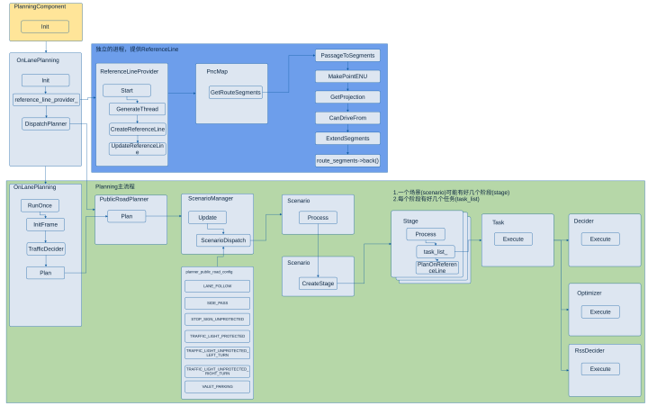
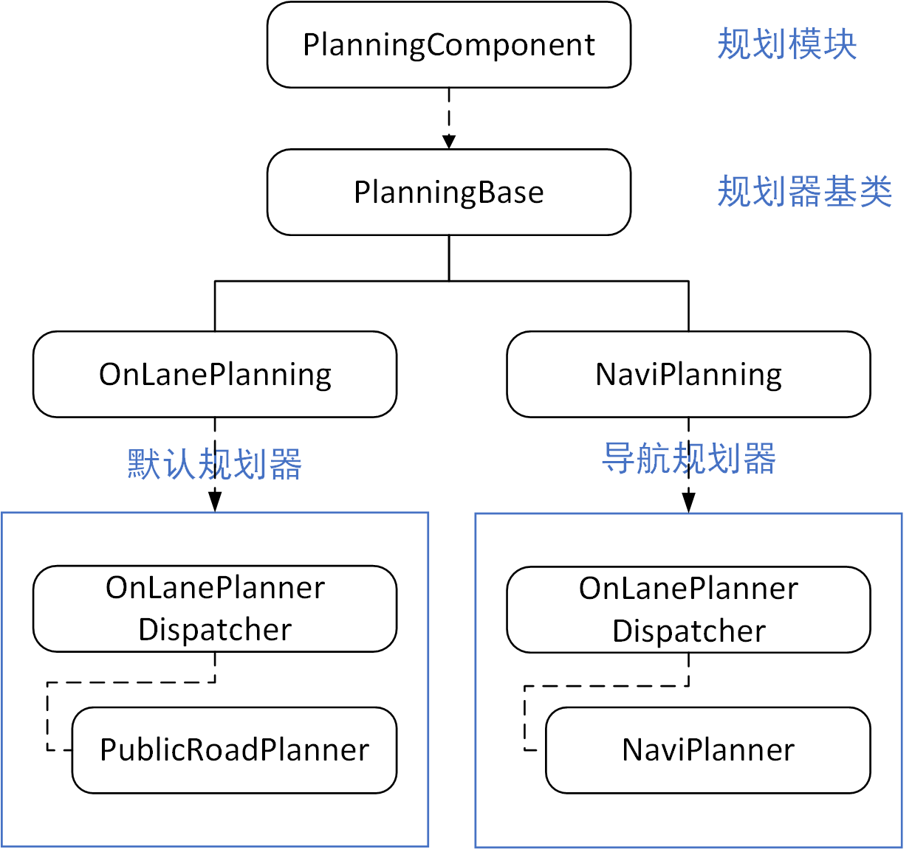
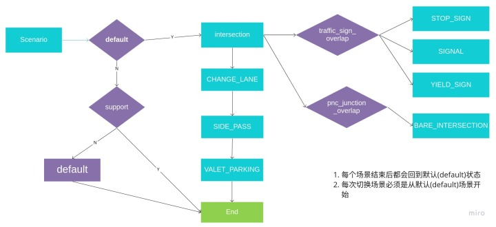
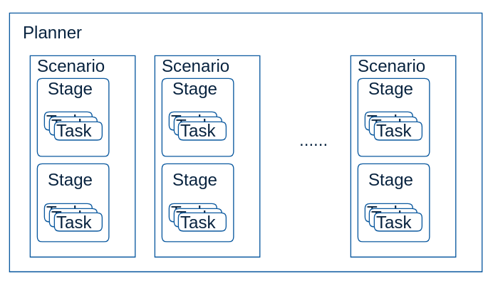
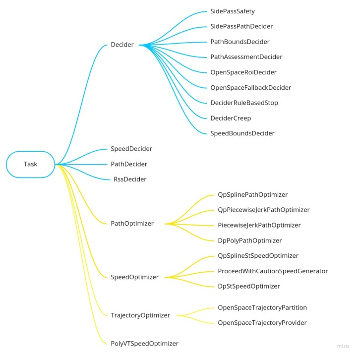

# Dig into Apollo - Planning 

> 吾尝终日而思矣 不如须臾之所学也


## Table of Contents
- [Planning模块简介](#introduction)
  - [Planning输入输出](#planning_io)
  - [Planning整个流程](#planning_flow)
- [Planning模块入口](#planning_entry)
  - [模块注册](#planning_register)
  - [模块初始化](#planning_init)
  - [模块运行](#planning_proc)
- [Reference line参考线](reference_line)
  - [介绍](reference_line#introduction)
  - [参考线](reference_line#rf_line)
  - [平滑器](reference_line#rf_smoother)
  - [参考线提供者](reference_line#rf_provider)  
- [OnLanePlanning](#onLanePlanning)
  - [初始化](#onLanePlanning_init)
  - [事件触发](#onLanePlanning_trigger)
- [Planner](#planner)
  - [Planner注册场景](#planner_register)
  - [运行场景](#planner_plan)
- [Scenario](#scenario)
  - [场景转换](#scenario_update)
  - [场景运行](#scenario_process)
- [Task](#task)
  - [DP & QP](#dp_qp)
- [Reference](#reference)
  

<a name="introduction" />

## Planning模块简介
规划(planning)模块的作用是根据感知预测的结果，当前的车辆信息和路况规划出一条车辆能够行驶的轨迹，这个轨迹会交给控制(control)模块，控制模块通过油门，刹车和方向盘使得车辆按照规划的轨迹运行。
规划模块的轨迹是短期轨迹，即车辆短期内行驶的轨迹，长期的轨迹是routing模块规划出的导航轨迹，即起点到目的地的轨迹，规划模块会先生成导航轨迹，然后根据导航轨迹和路况的情况，沿着短期轨迹行驶，直到目的地。这点也很好理解，我们开车之前先打开导航，然后根据导航行驶，如果前面有车就会减速或者变道，超车，避让行人等，这就是短期轨迹，结合上述的方式直到行驶到目的地。  

<a name="planning_io" />

#### Planning输入输出
我们先看下Apollo的数据流向：$\textcolor{red}{下图保留，待更新}$​​


可以看到规划(planning)模块的上游是Localization, Prediction, Routing模块，而下游是Control模块。Routing模块先规划出一条导航线路，然后Planning模块根据这条线路做局部优化，如果Planning模块发现短期规划的线路行不通（比如前面修路，或者错过了路口），会触发Routing模块重新规划线路，因此这两个模块的数据流是双向的。
Planning模块的输入在"planning_component.h"中，接口如下:

```c++
  bool Proc(const std::shared_ptr<prediction::PredictionObstacles>&
                prediction_obstacles,
            const std::shared_ptr<canbus::Chassis>& chassis,
            const std::shared_ptr<localization::LocalizationEstimate>&
                localization_estimate) override;
```
输入参数为:
1. 预测的障碍物信息(prediction_obstacles)
2. 车辆底盘(chassis)信息(车辆的速度，加速度，航向角等信息)
3. 车辆当前位置(localization_estimate)
> 实际上还有高精度地图信息，不在参数中传入，而是在函数中直接读取的。  

Planning模块的输出结果在"PlanningComponent::Proc()"中，为规划好的线路，发布到Control模块订阅的Topic中。
输出结果为：规划好的路径。

```c++
// ADCTrajectory消息类型参考 'modules/planning/proto/planning.proto'

planning_writer_->Write(adc_trajectory_pb);
```

<a name="planning_flow" />

#### Planning整个流程
下图是整个Planning模块的执行过程：
  

1. 模块的入口是PlanningComponent，在Cyber中注册模块，订阅和发布消息，并且注册对应的Planning类。
2. Planning的过程之前是定时器触发，即每隔一段固定的时间执行一次，现已经改为事件触发，即只要收集完成对应TOPIC的消息，就会触发执行，这样的好处是提高的实时性。
3. Planning类主要实现了2个功能，一个是启动ReferenceLineProvider来提供参考线，后面生成的轨迹都是在参考线的基础上做优化，ReferenceLineProvider启动了一个单独的线程，每隔50ms执行一次，和Planning主流程并行执行。Planning类另外的一个功能是执行Planning主流程。
4. Planning主流程先是选择对应的Planner，我们这里主要分析PublicRoadPlanner，在配置文件中定义了Planner支持的场景(Scenario)，把规划分为具体的几个场景来执行，每个场景又分为几个阶段(Stage)，每个阶段会执行多个任务(Task)，任务执行完成后，对应的场景就完成了。不同场景间的切换是由一个状态机(ScenarioDispatch)来控制的。规划控制器根据ReferenceLineProvider提供的参考线，在不同的场景下做切换，生成一条车辆可以行驶的轨迹，并且不断重复上述过程直到到达目的地。


接下来我们逐步分析整个planning模块的代码结构。

<a name="planning_entry" />

## Planning模块入口

<a name="planning_register" />

#### 模块注册
Planning模块的入口为"planning_component.h"和"planning_component.cc"两个文件，实现的功能如下：
```c++
// 订阅和发布消息
std::shared_ptr<cyber::Reader<perception::TrafficLightDetection>>
    traffic_light_reader_;
std::shared_ptr<cyber::Reader<routing::RoutingResponse>> routing_reader_;
std::shared_ptr<cyber::Reader<planning::PadMessage>> pad_message_reader_;
std::shared_ptr<cyber::Reader<relative_map::MapMsg>> relative_map_reader_;
std::shared_ptr<cyber::Reader<storytelling::Stories>>
    story_telling_reader_;

std::shared_ptr<cyber::Writer<ADCTrajectory>> planning_writer_;
std::shared_ptr<cyber::Writer<routing::RoutingRequest>> rerouting_writer_;
std::shared_ptr<cyber::Writer<PlanningLearningData>>
    planning_learning_data_writer_;
  
// 在Cyber中注册模块
CYBER_REGISTER_COMPONENT(PlanningComponent)
```

<a name="planning_init" />

#### 模块初始化
除了注册模块，订阅和发布消息之外，planning模块实现了2个主要函数"init"和"proc"。
Init中实现了模块的初始化：

```c++
// 'modules/planning/planning_component.cc'

  if (FLAGS_use_navigation_mode) {
    planning_base_ = std::make_unique<NaviPlanning>(injector_);
  } else {
    planning_base_ = std::make_unique<OnLanePlanning>(injector_);
  }
```
上面实现了2种Planning的注册，planning模块根据配置选择不同的Planning实现方式，"FLAGS_use_navigation_mode"代表“use_navigation_mode”，这是google开源项目gflags的用法。“use_navigation_mode”的定义在“modules/common/configs/config_gflags.cc”文件中，如下所示：

```c++
DEFINE_bool(use_navigation_mode, false,
            "Use relative position in navigation mode");
```

可见，其默认值为false，因此Planning默认情况下的实现是"OnLanePlanning"。下面介绍下这2种Planning的区别。

* **NaviPlanning** - 导航规划器，主要用于高速公路。
* **OnLanePlanning** - 车道规划器（默认），可用于城区及高速公路各种复杂道路。

模块之间的关系如下：


可以看到"NaviPlanning"和"OnLanePlanning"都继承自同一个基类，并且在PlanningComponent中通过配置选择一个具体的实现进行注册，通过父类指针（planning_base_）指向子类对象实现。  

Init接下来加载配置文件“planning_config.pb.txt”，检查是否开启了学习模式，然后实现了具体的消息发布和消息订阅：
```c++
// 加载配置文件
ACHECK(ComponentBase::GetProtoConfig(&config_))
    << "failed to load planning config file "
    << ComponentBase::ConfigFilePath();

// 检查是否开启了学习模式，如果开启，则没有后面什么事儿了
// planning_offline_learning默认值为false
// learning_mode默认值为NO_LEARNING
// 因此学习模式未开启
if (FLAGS_planning_offline_learning ||
    config_.learning_mode() != PlanningConfig::NO_LEARNING) {
    if (!message_process_.Init(config_, injector_)) {
      AERROR << "failed to init MessageProcess";
      return false;
    }
  }

// 根据配置文件初始化规划器
planning_base_->Init(config_);

// 读取routing模块的消息
routing_reader_ = node_->CreateReader<RoutingResponse>(
      config_.topic_config().routing_response_topic(),
      [this](const std::shared_ptr<RoutingResponse>& routing) {
        AINFO << "Received routing data: run routing callback."
              << routing->header().DebugString();
        std::lock_guard<std::mutex> lock(mutex_);
        routing_.CopyFrom(*routing);
      });
// 读取红绿灯
  traffic_light_reader_ = ...
// 读取行车状态
  pad_msg_reader_ = ...
// 读取场景管理器
  story_telling_reader_ = ...
// 如果使用导航模式
  if (FLAGS_use_navigation_mode) {
    // 读取相对地图
    relative_map_reader_ = ...
  }

// 发布规划好的线路
  planning_writer_ = node_->CreateWriter<ADCTrajectory>
      (config_.topic_config().planning_trajectory_topic());
// 发布重新规划请求
  rerouting_writer_ = node_->CreateWriter<RoutingRequest>
      (config_.topic_config().routing_request_topic());
// 发布学习数据
  planning_learning_data_writer_ = node_->
      CreateWriter<PlanningLearningData>
      (config_.topic_config().planning_learning_data_topic());
```
至此，Planning模块的初始化就完成了。
其中 ==planning_offline_learning== 和 ==learning_mode== 的配置分别如下所示：

```c++
// 'modules/planning/common/planning_gflags.cc'

DEFINE_bool(planning_offline_learning, false,
            "offline learning. read record files and dump learning_data");
```

```
// 'modules/planning/conf/planning_config.pb.txt'

learning_mode: NO_LEARNING
```

<a name="planning_proc" />

#### 模块运行
Proc的主要是检查数据，并且执行注册好的Planning，生成路线并且发布。
```c++
bool PlanningComponent::Proc(...) {
  ACHECK(prediction_obstacles != nullptr);
  
  // 1. 检查是否需要重新规划线路。
  CheckRerouting();

  // 2. 数据放入local_view_中，并且检查输入数据。
  ...
  
  // 3. 如果启用了学习模式
  if (config_.learning_mode() != PlanningConfig::NO_LEARNING) {
    // 处理数据，用于在线训练
    message_process_.OnChassis(*local_view_.chassis);
    message_process_.OnPrediction(*local_view_.prediction_obstacles);
    message_process_.OnRoutingResponse(*local_view_.routing);
    message_process_.OnStoryTelling(*local_view_.stories);
    message_process_.OnTrafficLightDetection(*local_view_.traffic_light);
    message_process_.OnLocalization(*local_view_.localization_estimate);
  }
  // 4. 如果学习模式为RL_TEST，则发布学习数据帧给RL test
  // 如果启用了学习模式，则没后面什么事情了
  if (config_.learning_mode() == PlanningConfig::RL_TEST) {
    PlanningLearningData planning_learning_data;
    LearningDataFrame* learning_data_frame =
        injector_->learning_based_data()->GetLatestLearningDataFrame();
    if (learning_data_frame) {
      planning_learning_data.mutable_learning_data_frame()
                            ->CopyFrom(*learning_data_frame);
      common::util::FillHeader(node_->Name(), &planning_learning_data);
      planning_learning_data_writer_->Write(planning_learning_data);
    } else {
      AERROR << "fail to generate learning data frame";
      return false;
    }
    return true;
  }
  // 5. 执行注册好的Planning，生成轨迹。
  ADCTrajectory adc_trajectory_pb;
  planning_base_->RunOnce(local_view_, &adc_trajectory_pb);
  common::util::FillHeader(node_->Name(), &adc_trajectory_pb);
  
  // 6. 修正轨迹的相对时间（由于消息头中的时间戳改变而导致的）
  // 这步操作很迷，难道 dt != 0 吗？
  auto start_time = adc_trajectory_pb.header().timestamp_sec();
  const double dt = start_time - 
      adc_trajectory_pb.header().timestamp_sec();
  for (auto& p : *adc_trajectory_pb.mutable_trajectory_point()) {
    p.set_relative_time(p.relative_time() + dt);
  }

  // 7. 发布轨迹
  planning_writer_->Write(adc_trajectory_pb);
    
  // 8. 记录历史轨迹
  auto* history = injector_->history();
  history->Add(adc_trajectory_pb);

  return true;
}
```
整个"PlanningComponent"的分析就完成了，可以看到"PlanningComponent"是Planning模块的入口，在Apollo3.5引入了Cyber之后，实现了Planning模块在Cyber中的注册，订阅和发布topic消息。同时实现了2种不同的Planning，根据配置选择其中的一种并且运行。
由于默认的Planning是开放道路的OnLanePlanning，我们接下来主要分析这个Planning。

<a name="onLanePlanning" />

## OnLanePlanning
每次Planning会根据以下2个信息作为输入来执行：
1. Planning上下文信息
2. Frame结构体(车辆信息，位置信息等所有规划需要用到的信息，在 /planning/common/frame.h 中

```c++
static DrivingAction pad_msg_driving_action_;
uint32_t sequence_num_ = 0;
LocalView local_view_;
const hdmap::HDMap *hdmap_ = nullptr;
common::TrajectoryPoint planning_start_point_;
common::VehicleState vehicle_state_;
std::list<ReferenceLineInfo> reference_line_info_;

bool is_near_destination_ = false;

/**
* the reference line info that the vehicle finally choose to drive on
**/
const ReferenceLineInfo *drive_reference_line_info_ = nullptr;

ThreadSafeIndexedObstacles obstacles_;

std::unordered_map<std::string, const perception::TrafficLight *>
  traffic_lights_;

// current frame published trajectory
ADCTrajectory current_frame_planned_trajectory_;  // 最近发布的轨迹

// current frame path for future possible speed fallback
DiscretizedPath current_frame_planned_path_;

const ReferenceLineProvider *reference_line_provider_ = nullptr;

OpenSpaceInfo open_space_info_;  // ？

std::vector<routing::LaneWaypoint> future_route_waypoints_;

common::monitor::MonitorLogBuffer monitor_logger_buffer_;  // ？
```

<a name="onLanePlanning_init" />

#### 初始化
OnLanePlanning的初始化逻辑在Init中，主要实现分配具体的Planner，启动参考线提供器(reference_line_provider_)，代码分析如下：
```c++
Status OnLanePlanning::Init(const PlanningConfig& config) {
  ...
  
  // 启动参考线提供器，会另启动一个线程，执行一个定时任务，每隔50ms提供一次参考线。
  reference_line_provider_ = std::make_unique<ReferenceLineProvider>
      (injector_->vehicle_state(), hdmap_);
  reference_line_provider_->Start();

  // 为Planning分配具体的Planner。
  planner_ = planner_dispatcher_->DispatchPlanner(config_, injector_);
  
  ...
}
```

可以看到"PlannerDispatcher"在"OnLanePlanning"实例化的时候就指定了。
```c++
class OnLanePlanning : public PlanningBase {
 public:
  explicit OnLanePlanning(const std::shared_ptr<DependencyInjector>& 
                          injector) {
    planner_dispatcher_ = std::make_unique<OnLanePlannerDispatcher>();
  }
```
再看"OnLanePlannerDispatcher"具体的实现，也是根据配置选择具体的"Planner"，默认为"PUBLIC_ROAD"规划器:
```c++
// 配置文件
standard_planning_config {
  planner_type: PUBLIC_ROAD
  planner_public_road_config {
  }
}

// OnLanePlannerDispatcher具体实现
std::unique_ptr<Planner> OnLanePlannerDispatcher::DispatchPlanner(
    const PlanningConfig& planning_config,
    const std::shared_ptr<DependencyInjector>& injector) {
  return planner_factory_.CreateObject(
      planning_config.standard_planning_config().planner_type(0), 
      injector);
}
```

<a name="onLanePlanning_trigger" />

#### 事件触发

OnLanePlanning的主要逻辑在"RunOnce()"中，在Apollo 3.5之前是定时器触发，3.5改为事件触发，即收到对应的消息之后，就触发执行，这样做的好处是增加了实时性 [参考](https://github.com/ApolloAuto/apollo/issues/6572)。  
```c++
void OnLanePlanning::RunOnce(const LocalView& local_view,
                             ADCTrajectory* const ptr_trajectory_pb) {
  // when rerouting, reference line might not be updated. In this case, 
  // planning module maintains not-ready until be restarted.
  static bool failed_to_update_reference_line = false;
  local_view_ = local_view;
  const double start_timestamp = Clock::NowInSeconds();
  const double start_system_timestamp =
      std::chrono::duration<double>(
          std::chrono::system_clock::now().time_since_epoch())
          .count();
  
  // 1. 检查定位状态
  ADEBUG << "Get localization:"
         << local_view_.localization_estimate->DebugString();
    
  // 2. 检查底盘状态
  ADEBUG << "Get chassis:" << local_view_.chassis->DebugString();
    
  // 3. 根据定位和底盘信息 更新 车辆状态
  Status status = injector_->vehicle_state()->Update(
      *local_view_.localization_estimate, *local_view_.chassis);
  
  // 4. 获取传入规划器的车辆状态
  VehicleState vehicle_state = injector_->vehicle_state()->vehicle_state();
  
  ...
  
  // 5. 如果车辆状态更新失败 或 传入的车辆状态不可用，则规划停车轨迹
  if (!status.ok() || !util::IsVehicleStateValid(vehicle_state)) {
    const std::string msg =
        "Update VehicleStateProvider failed "
        "or the vehicle state is out dated.";
    AERROR << msg;
    ptr_trajectory_pb->mutable_decision()
        ->mutable_main_decision()
        ->mutable_not_ready()
        ->set_reason(msg);
    status.Save(ptr_trajectory_pb->mutable_header()->mutable_status());
    // TODO(all): integrate reverse gear
    ptr_trajectory_pb->set_gear(canbus::Chassis::GEAR_DRIVE);
    FillPlanningPb(start_timestamp, ptr_trajectory_pb);
    GenerateStopTrajectory(ptr_trajectory_pb);
    return;
  }
  
  // 6. 如果当前的时间比传入的车辆状态的时间 延迟 小于 0.02s，则对齐时间戳
  // 具体对齐时间戳的操作待研究
  if (start_timestamp - vehicle_state_timestamp <
      FLAGS_message_latency_threshold) {
    vehicle_state = AlignTimeStamp(vehicle_state, start_timestamp);
  }
  
  // 7. 如果最近的routing结果与当前的不同（即触发了rerouting），则更新
  if (util::IsDifferentRouting(last_routing_, *local_view_.routing)) {
    last_routing_ = *local_view_.routing;
    ADEBUG << "last_routing_:" << last_routing_.ShortDebugString();
    injector_->history()->Clear();
    injector_->planning_context()->mutable_planning_status()->Clear();
    reference_line_provider_->UpdateRoutingResponse(*local_view_.routing);
    planner_->Init(config_);
  }
  
  // 8. 更新参考线
  failed_to_update_reference_line =
      (!reference_line_provider_->UpdatedReferenceLine()); 
    
  // 9. 如果参考线更新失败，则提前退出
  if (failed_to_update_reference_line) {
    const std::string msg = "Failed to update reference line after rerouting.";
    AERROR << msg;
    ptr_trajectory_pb->mutable_decision()
        ->mutable_main_decision()
        ->mutable_not_ready()
        ->set_reason(msg);
    status.Save(ptr_trajectory_pb->mutable_header()->mutable_status());
    ptr_trajectory_pb->set_gear(canbus::Chassis::GEAR_DRIVE);
    FillPlanningPb(start_timestamp, ptr_trajectory_pb);
    GenerateStopTrajectory(ptr_trajectory_pb);
    return;
  }
    
  // 10. Update reference line provider and reset pull over if necessary
  reference_line_provider_->UpdateVehicleState(vehicle_state); 
    
  // planning is triggered by prediction data, but we can still use an 
  // estimated cycle time for stitching
  const double planning_cycle_time =
      1.0 / static_cast<double>(FLAGS_planning_loop_rate);
  
  ...
  
  // 11. 初始化Frame
  status = InitFrame(frame_num, stitching_trajectory.back(),
                     vehicle_state);
  ...
  
  // 12. 判断是否符合交通规则
  for (auto& ref_line_info : *frame_->mutable_reference_line_info()) {
    TrafficDecider traffic_decider;
    traffic_decider.Init(traffic_rule_configs_);
    auto traffic_status = traffic_decider.Execute(frame_.get(), 
                                                  &ref_line_info, injector_);
    if (!traffic_status.ok() || !ref_line_info.IsDrivable()) {
      ref_line_info.SetDrivable(false);
      AWARN << "Reference line " << ref_line_info.Lanes().Id()
            << " traffic decider failed";
    }
  }

  // 13.执行规划
  status = Plan(start_timestamp, stitching_trajectory, ptr_trajectory_pb);
  
  ...
}


Status OnLanePlanning::Plan(
    const double current_time_stamp,
    const std::vector<TrajectoryPoint>& stitching_trajectory,
    ADCTrajectory* const ptr_trajectory_pb) {
  
  ...
  
  // 调用具体的(PUBLIC_ROAD)Planner执行
  auto status = planner_->Plan(stitching_trajectory.back(), frame_.get(),
                               ptr_trajectory_pb);
  
  // 后续分了两种情况处理
  // 其一为 open space，这里代表场景应该是道路之外的停车场
  // open space planner的原本设计就是自主泊车，当前已合并入public road planner
  // 其二为 其他，这里应该是普通道路场景
  ...
}
```

上述就是"OnLanePlanning"的执行过程，先是Planner分发器根据配置，选择具体的planner，然后初始化Frame，(PUBLIC_ROAD)planner根据输入帧执行"Plan"方法。


<a name="planner" />

## Planner
我们先看下Planner目录结构，一共实现了4种Planner：
```
.
├── BUILD
├── navi_planner_dispatcher.cc
├── navi_planner_dispatcher.h
├── navi_planner_dispatcher_test.cc
├── on_lane_planner_dispatcher.cc
├── on_lane_planner_dispatcher.h
├── on_lane_planner_dispatcher_test.cc
├── planner_dispatcher.cc
├── planner_dispatcher.h
├── planner.h
├── lattice           // lattice planner
├── navi              // navi planner
├── public_road       // public road planner
└── rtk               // rtk planner
```
可以看到Planner目录分别实现了Planner发布器和具体的Planner，关于发布器我们后面会根据流程图来介绍，这里先介绍一下5种不同的Planner。
* **rtk**          - 根据录制的轨迹来规划行车路线
* **public_road**  - 开放道路的轨迹规划器
* **lattice**      - 基于网格算法的轨迹规划器
* **navi**         - 基于实时相对地图的规划器

<a name="planner_register" />

#### Planner注册场景
下面我们整理一下planner模块的流程：


1. PlanningComponent在cyber中注册
2. 选择Planning
3. 根据不同的Dispatcher，分发Planner

下面我们主要介绍"PublicRoadPlanner"，主要的实现还是在Init和Plan中。
init中主要是注册规划器支持的场景(scenario)。  

```c++
// 'modules/planning/planner/public_road/public_road_planner.cc'
Status PublicRoadPlanner::Init(const PlanningConfig& config) {
  // 初始化配置文件
  config_ = config;
  // 根据配置文件初始化场景管理器
  scenario_manager_.Init(config);
  return Status::OK();
}

// 'modules/planning/scenarios/scenario_manager.cc'
bool ScenarioManager::Init(const PlanningConfig& planning_config) {
  // 初始化配置文件
  planning_config_.CopyFrom(planning_config);
  // 注册场景
  RegisterScenarios();
  // 创建默认场景
  default_scenario_type_ = ScenarioConfig::LANE_FOLLOW;
  current_scenario_ = CreateScenario(default_scenario_type_);
  return true;
}
```
我们看下"PublicRoadPlanner"支持的场景有哪些？  $\textcolor{red}{需要更正，重要}$
```
// 还是在"/conf/planning_config.pb.txt"中
standard_planning_config {
  planner_type: PUBLIC_ROAD
  planner_type: OPEN_SPACE
  planner_public_road_config {
     // 支持的场景
     scenario_type: LANE_FOLLOW  // 车道线保持
     scenario_type: SIDE_PASS    // 超车
     scenario_type: STOP_SIGN_UNPROTECTED  // 停止
     scenario_type: TRAFFIC_LIGHT_PROTECTED    // 红绿灯
     scenario_type: TRAFFIC_LIGHT_UNPROTECTED_LEFT_TURN  // 红绿灯左转
     scenario_type: TRAFFIC_LIGHT_UNPROTECTED_RIGHT_TURN // 红绿灯右转
     scenario_type: VALET_PARKING  // 代客泊车
  }
```

<a name="planner_plan" />

#### 运行场景
接着看"Plan"中的实现：
```c++
Status PublicRoadPlanner::Plan(const TrajectoryPoint& planning_start_point,
                               Frame* frame,
                               ADCTrajectory* ptr_computed_trajectory) {
  // 更新场景，决策当前应该执行什么场景
  scenario_manager_.Update(planning_start_point, *frame);
  // 获取当前场景
  scenario_ = scenario_manager_.mutable_scenario();
  // 执行当前场景的任务
  auto result = scenario_->Process(planning_start_point, frame);

  ...
  
  // 当前场景完成
  if (result == scenario::Scenario::STATUS_DONE) {
    // only updates scenario manager when previous scenario's status is
    // STATUS_DONE
    scenario_manager_.Update(planning_start_point, *frame);
  } else if (result == scenario::Scenario::STATUS_UNKNOWN) {
    // 当前场景失败
    return Status(common::PLANNING_ERROR, "scenario returned unknown");
  }
  return Status::OK();
}
```

可以看到"Planner"模块把具体的规划转化成一系列的场景，每次执行规划之前先判断更新当前的场景，然后针对具体的场景去执行。
下面我们先看下"Scenario"模块，然后把这2个模块串起来讲解。  


<a name="scenario" />

## Scenario
我们同样先看下"Scenario"的目录结构：
```
.
├── bare_intersection\unprotected
├── BUILD
├── common
├── emergency
├── lane_follow            // 车道线保持
├── learning_model
├── narrow_street_u_turn   // 狭窄掉头
├── park
├── park_and_go
├── scenario.cc
├── scenario.h
├── scenario_manager.cc
├── scenario_manager.h
├── stage.cc
├── stage.h
├── stop_sign             // 停止
├── traffic_light         // 红绿灯
├── util
└── yield_sign
```
其中需要知道场景如何转换，以及每种场景如何执行。几种场景的介绍可以先看下Apollo的官方文档[planning](https://github.com/ApolloAuto/apollo/blob/master/modules/planning/README.md)，主要的场景是lane_follow，side_pass和stop_sign。

<a name="scenario_update" />

#### 场景转换
场景转换的实现在"scenario_manager.cc"中，其中实现了场景注册，创建场景和更新场景的功能。  
```c++
bool ScenarioManager::Init(const PlanningConfig& planning_config) {
  planning_config_.CopyFrom(planning_config);
  // 注册场景
  RegisterScenarios();
  default_scenario_type_ = ScenarioConfig::LANE_FOLLOW;
  // 创建场景，默认为lane_follow
  current_scenario_ = CreateScenario(default_scenario_type_);
  return true;
}

// 更新场景
void ScenarioManager::Update(const common::TrajectoryPoint& ego_point,
                             const Frame& frame) {
  CHECK(!frame.reference_line_info().empty());
  // 保留当前帧
  Observe(frame);
  // 场景分发
  ScenarioDispatch(frame);
}

// 通过一个有限状态机，决定当前的场景
void ScenarioManager::ScenarioDispatch(const Frame& frame) {
  ...
}

```
其中"ScenarioDispatch"的状态切换可以参考下图:   $\textcolor{red}{待更新}$
  

可以看到，每次切换场景必须是从默认场景(LANE_FOLLOW)开始，即每次场景切换之后都会回到默认场景。
> ScenarioDispatch目前的代码还没完全完成(有些分支TODO)，而且个人感觉这个实现不够简介和优秀，逻辑看起来有些混乱，不知道是否可以用状态机改进？

<a name="scenario_process" />

#### 场景运行
场景的执行在"scenario.cc"和对应的场景目录中，实际上每个场景又分为一个或者多个阶段(stage)，每个阶段又由不同的任务(task)组成。执行一个场景，就是顺序执行不同阶段的不同任务。
  Scenario对应的stage和task在"planning/conf/scenario"中。

由于Scenario都是顺序执行，只需要判断这一阶段是否结束，然后转到下一个阶段就可以了。具体的实现在：  
```c++
Scenario::ScenarioStatus Scenario::Process(
    const common::TrajectoryPoint& planning_init_point, Frame* frame) {
  ...
  
  // 如果当前阶段完成，则退出
  if (current_stage_->stage_type() == ScenarioConfig::NO_STAGE) {
    scenario_status_ = STATUS_DONE;
    return scenario_status_;
  }
  
  // 进入下一阶段执行或者错误处理
  auto ret = current_stage_->Process(planning_init_point, frame);
  switch (ret) {
    case Stage::ERROR: {
      ...}
    case Stage::RUNNING: {
      ...}
    case Stage::FINISHED: {
      ...}
    default: {
      ...}
  }
  return scenario_status_;
}
```

我们接着看一下Stage中"Process"的执行：  
```c++
Stage::StageStatus LaneFollowStage::Process(
    const TrajectoryPoint& planning_start_point, Frame* frame) {
    ...
    // 根据参考线规划
    auto cur_status =
        PlanOnReferenceLine(planning_start_point, frame, 
                            &reference_line_info);
    ...
}

// LANE_FOLLOW中的PlanOnReferenceLine
Status LaneFollowStage::PlanOnReferenceLine(
    const TrajectoryPoint& planning_start_point, Frame* frame,
    ReferenceLineInfo* reference_line_info) {
  ...
  auto ret = Status::OK();
  // 顺序执行stage中的任务
  for (auto* task : task_list_) {
    const double start_timestamp = Clock::NowInSeconds();
    // 执行当前任务
    ret = task->Execute(frame, reference_line_info);
    const double end_timestamp = Clock::NowInSeconds();
    const double time_diff_ms = (end_timestamp - start_timestamp) * 1000;
    ADEBUG << "after task[" << task->Name()
           << "]:" << reference_line_info->PathSpeedDebugString();
    ADEBUG << task->Name() << " time spend: " << time_diff_ms << " ms.";
    RecordDebugInfo(reference_line_info, task->Name(), time_diff_ms);

    if (!ret.ok()) {
      AERROR << "Failed to run tasks[" << task->Name()
             << "], Error message: " << ret.error_message();
      break;
    }
  }

  ...
  
  // 增加障碍物的代价
  for (const auto* obstacle :
       reference_line_info->path_decision()->obstacles().Items()) {
    if (obstacle->IsVirtual()) {
      continue;
    }
    if (!obstacle->IsStatic()) {
      continue;
    }
    if (obstacle->LongitudinalDecision().has_stop()) {
      ...
    }
  }
  
  ...
     
  // 返回参考线
  reference_line_info->SetTrajectory(trajectory);
  reference_line_info->SetDrivable(true);
  return Status::OK();
}
```
上面是用"LaneFollowStage"中的"PlanOnReferenceLine"来举例子，不同场景中的"PlanOnReferenceLine"实现可能也不一样，这样设计的好处是，当发现一个场景有问题，需要修改不会影响到其他的场景。同时也可以针对不同场景做优化，比通用的规划更加适合单独的场景。每种场景都有一个专门的目录来进行优化。  

接下来我们看下Task是如何执行的。  


<a name="task" />

## Task
我们先看Task的目录结构：  
```
.
├── BUILD
├── deciders       // 决策器
├── optimizers     // 优化器
├── rss
├── smoothers     // 平滑器
├── task.cc
├── task_factory.cc
├── task_factory.h
└── task.h
```
可以看到每个Task都可以对应到一个决策器或者优化器（平滑器不作为Task，单独作为一个类）。  

每个Task都实现了"Execute"方法，而每个决策器和优化器都继承至Task类。可以参考下图：  
  

> Task类的生成用到了设计模式的工厂模式，通过"TaskFactory"类生产不同的Task类。

<a name="dp_qp" />

#### DP & QP
Task中的决策器和优化器采用的方法有DP和QP:
* **DP** 动态规划
* **QP** 二次规划

QP方法的路径优化和速度优化可以参考apollo文档:  
[QP-Spline-Path Optimizer](https://github.com/ApolloAuto/apollo/blob/master/docs/specs/qp_spline_path_optimizer.md)  
[QP-Spline-ST-Speed Optimizer](https://github.com/ApolloAuto/apollo/blob/master/docs/specs/qp_spline_st_speed_optimizer.md)  


<a name="reference" />

## Reference
[解析百度Apollo之决策规划模块](https://paul.pub/apollo-planning/#id-planning%E4%B8%8Eplanner)  
[Open Space Planner Algorithm](https://github.com/ApolloAuto/apollo/blob/master/docs/specs/Open_Space_Planner.md)  


