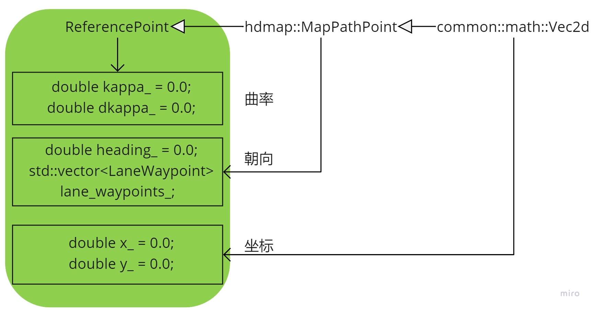
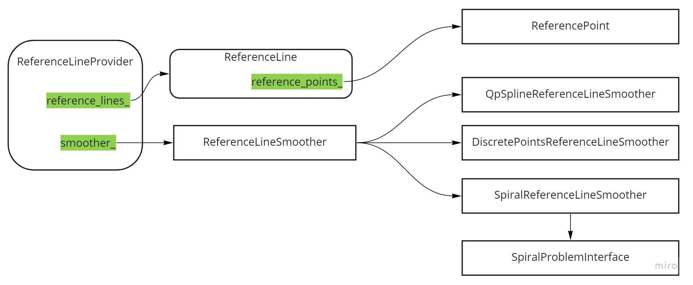
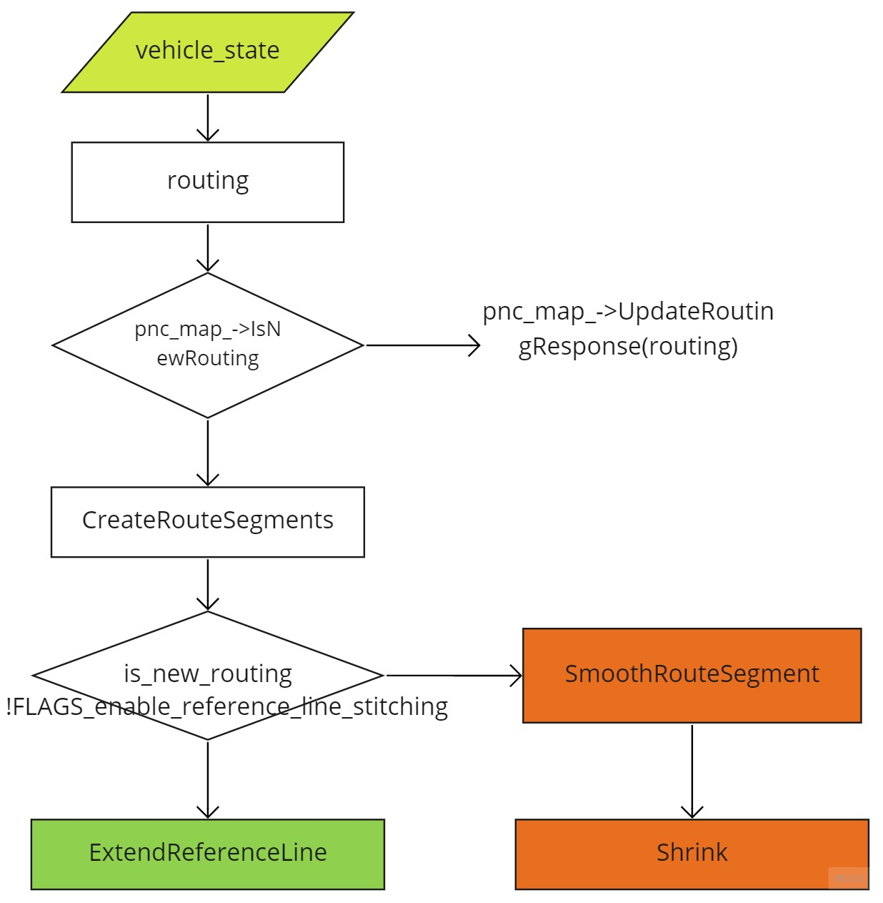

# Dig into Apollo - Reference line 

> 尽吾志也而不能至者，可以无悔矣


## Table of Contents
- [介绍](#introduction)
- [参考线](#rf_line)
- [平滑器](#rf_smoother)  
- [参考线提供者](#rf_provider)


<a name="introduction" />

## 参考线介绍(Reference line)  

参考线是根据routing规划的路线，生成一系列参考轨迹，提供给规划算法做为参考，从而生成最终的规划轨迹。
为什么要提供参考呢？因为道路是结构化道路，在没有参考的情况下，需要通过搜索算法来查找路线，这种场景在机器人路径规划中比较普遍，机器人在一个开放空间只要没有障碍物它就可以行走，而车不一样，车是在道路上行驶的，在提供参考的情况下，节省了查找的时间和复杂度，降低了算法的难度，这也就是参考线的意义。  

1. ReferenceLine和ReferenceLineInfo的关系
ReferenceLine提供的是轨迹信息，而ReferenceLineInfo在ReferenceLine的基础上新添加了决策信息。  


<a name="rf_line" />

## 参考线(ReferenceLineInfo)
参考线信息，在参考线的基础添加了决策信息，ST图等。


#### 参考线中的点(ReferencePoint)  
参考线中的点继承至`hdmap::MapPathPoint`，而`hdmap::MapPathPoint`又继承至`common::math::Vec2d`，也就是说参考线中的点实际上包含了路径点的信息，它有原来路径点中的朝向和坐标信息，同时还新增加了曲率信息，通过下图我们可以清楚的看出上述关系。  
  


#### 参考线(ReferenceLine)  
理解了参考线中的点之后，我们再看参考线的数据结构。  
```c++
  std::vector<SpeedLimit> speed_limit_;  // 速度限制
  std::vector<ReferencePoint> reference_points_;  // 参考线的点
  hdmap::Path map_path_;  // 路径
  uint32_t priority_ = 0;  // 优先级
```
其中速度限制主要标明参考线中哪些段有速度限制，因为是一个数组，因此一个参考线中可以有多段不同的限速。优先级则表示了当前参考线的优先级，用于后面有多个参考线的时候进行挑选。  
参考线中的点也是一个数组，也就是说参考线是由参考点组成的，而`map_path_`则是最不好理解的，实际上`map_path_`就是地图中参考线，把参考线中的点转换到地图中，因此`map_path_`中的点和参考点数组的大小是一致的。  

除此之外，参考线还提供了一些方法，通过这些方法我们可以拼接参考线，也可以判断参考线所在位置的路的宽度，以及是否在路上等信息。我们先分析这些方法的功能实现，然后再介绍哪些场景需要用到这些功能。  


#### 构造函数
我们可以看到有2种方式来生成ReferenceLine，可以通过一组参考点来生成，也可以通过地图路径来生成，这2者实际上是等价的，下面我们开始分析。
1. 通过一组参考点生成，`reference_points_`直接拷贝赋值了，然后再用`reference_points`生成`hdmap::MapPathPoint`，最后保存到`map_path_`。
```c++
ReferenceLine::ReferenceLine(
    const std::vector<ReferencePoint>& reference_points)
    : reference_points_(reference_points),
      map_path_(std::move(std::vector<hdmap::MapPathPoint>(
          reference_points.begin(), reference_points.end()))) {
    ...
}
```

2. 通过地图路径生成参考线。遍历路径中的点，然后取`lane_waypoints`中的第一个点，保存到参考点的数组中。
```c++
ReferenceLine::ReferenceLine(const MapPath& hdmap_path)
    : map_path_(hdmap_path) {
  for (const auto& point : hdmap_path.path_points()) {
    const auto& lane_waypoint = point.lane_waypoints()[0];
    reference_points_.emplace_back(
        hdmap::MapPathPoint(point, point.heading(), lane_waypoint), 0.0, 0.0);
  }
}
```

#### 缝合参考线(Stitch)
缝合参考线是把2段参考线连接起来，代码中也给出了下面2种情况。并且每次拼接的时候，会尽可能多的采用自身的参考线。  
```c++
   * Example 1
   * this:   |--------A-----x-----B------|
   * other:                 |-----C------x--------D-------|
   * Result: |------A-----x-----B------x--------D-------|
   * In the above example, A-B is current reference line, and C-D is the other
   * reference line. If part B and part C matches, we update current reference
   * line to A-B-D.
   *
   * Example 2
   * this:                  |-----A------x--------B-------|
   * other:  |--------C-----x-----D------|
   * Result: |--------C-----x-----A------x--------B-------|
   * In the above example, A-B is current reference line, and C-D is the other
   * reference line. If part A and part D matches, we update current reference
   * line to C-A-B.
```
接下来我们分析下代码。
```c++
bool ReferenceLine::Stitch(const ReferenceLine& other) {
  // 1. 找到起点的交点
  auto first_point = reference_points_.front();
  common::SLPoint first_sl;
  if (!other.XYToSL(first_point, &first_sl)) {
    AWARN << "Failed to project the first point to the other reference line.";
    return false;
  }
  bool first_join = first_sl.s() > 0 && first_sl.s() < other.Length();
  // 2. 找到终点的交点
  auto last_point = reference_points_.back();
  common::SLPoint last_sl;
  if (!other.XYToSL(last_point, &last_sl)) {
    AWARN << "Failed to project the last point to the other reference line.";
    return false;
  }
  bool last_join = last_sl.s() > 0 && last_sl.s() < other.Length();
  // 3. 如果起点和终点都没有交点，则退出
  if (!first_join && !last_join) {
    AERROR << "These reference lines are not connected.";
    return false;
  }

  // 累积s值
  const auto& accumulated_s = other.map_path().accumulated_s();
  // 参考点
  const auto& other_points = other.reference_points();
  auto lower = accumulated_s.begin();
  static constexpr double kStitchingError = 1e-1;

  if (first_join) {
    // 4. 如果横向偏移大于0.1m，则退出
    if (first_sl.l() > kStitchingError) {
      AERROR << "lateral stitching error on first join of reference line too "
                "big, stitching fails";
      return false;
    }
    lower = std::lower_bound(accumulated_s.begin(), accumulated_s.end(),
                             first_sl.s());
    // 4.1 因为this的起点在other之后，插入other的起点到this的起点
    size_t start_i = std::distance(accumulated_s.begin(), lower);
    reference_points_.insert(reference_points_.begin(), other_points.begin(),
                             other_points.begin() + start_i);
  }
  if (last_join) {
    // 5.1 如果横向偏移大于0.1m，则退出
    if (last_sl.l() > kStitchingError) {
      AERROR << "lateral stitching error on first join of reference line too "
                "big, stitching fails";
      return false;
    }
    // 5.2 因为this的终点小于other的终点，把other终点拼接到参考线的终点
    auto upper = std::upper_bound(lower, accumulated_s.end(), last_sl.s());
    auto end_i = std::distance(accumulated_s.begin(), upper);
    reference_points_.insert(reference_points_.end(),
                             other_points.begin() + end_i, other_points.end());
  }
  map_path_ = MapPath(std::move(std::vector<hdmap::MapPathPoint>(
      reference_points_.begin(), reference_points_.end())));
  return true;
}
```

#### 分割参考线(Segment)
分割参考线的方法是根据起点s，向前和向后的查看距离把参考线进行分割。 有2个方法，我们只看其中一个就可以了。  
```c++
bool ReferenceLine::Segment(const double s, const double look_backward,
                            const double look_forward) {
  const auto& accumulated_s = map_path_.accumulated_s();


  // 1. 查找向后的索引(look_backward)
  auto start_index =
      std::distance(accumulated_s.begin(),
                    std::lower_bound(accumulated_s.begin(), accumulated_s.end(),
                                     s - look_backward));
  // 2. 查找向前的索引(look_forward)
  auto end_index =
      std::distance(accumulated_s.begin(),
                    std::upper_bound(accumulated_s.begin(), accumulated_s.end(),
                                     s + look_forward));
  // 3. 如果只有一个点
  if (end_index - start_index < 2) {
    AERROR << "Too few reference points after shrinking.";
    return false;
  }
  
  // 4. 更新当前的参考线，并且返回成功
  reference_points_ =
      std::vector<ReferencePoint>(reference_points_.begin() + start_index,
                                  reference_points_.begin() + end_index);
  map_path_ = MapPath(std::vector<hdmap::MapPathPoint>(
      reference_points_.begin(), reference_points_.end()));
  return true;
}
```

#### 其它方法介绍
这里把其它一些方法的功能进行介绍，具体的代码就不展开分析了。
```c++
  // 根据s值获取参考点（会根据s进行插值）
  ReferencePoint GetReferencePoint(const double s) const;  
  // 根据x,y找到最近的点，并且进行插值
  ReferencePoint GetReferencePoint(const double x, const double y) const;  

  // PathPoint转换为FrenetFramePoint
  common::FrenetFramePoint GetFrenetPoint(
      const common::PathPoint& path_point) const;
  
  // 
  std::pair<std::array<double, 3>, std::array<double, 3>> ToFrenetFrame(
      const common::TrajectoryPoint& traj_point) const;

  // 查找起点和终点分别为start_s和end_s的参考点
  std::vector<ReferencePoint> GetReferencePoints(double start_s,
                                               double end_s) const;
  // 获取离s最近的索引
  size_t GetNearestReferenceIndex(const double s) const;  

  // 离s最近的ReferencePoint
  ReferencePoint GetNearestReferencePoint(const common::math::Vec2d& xy) const;
  ReferencePoint GetNearestReferencePoint(const double s) const;    

  // 根据起点s和终点s获取LaneSegment
  std::vector<hdmap::LaneSegment> GetLaneSegments(const double start_s,
                                                  const double end_s) const;
  // 获取box在参考线上的投影框
  bool GetApproximateSLBoundary(const common::math::Box2d& box,
                                const double start_s, const double end_s,
                                SLBoundary* const sl_boundary) const;
  bool GetSLBoundary(const common::math::Box2d& box,
                     SLBoundary* const sl_boundary) const;
  bool GetSLBoundary(const hdmap::Polygon& polygon,
                     SLBoundary* const sl_boundary) const;
  // SL坐标到XY坐标相互转换
  bool SLToXY(const common::SLPoint& sl_point,
              common::math::Vec2d* const xy_point) const;
  bool XYToSL(const common::math::Vec2d& xy_point,
              common::SLPoint* const sl_point) const;
  // 获取s距离处路的宽度
  bool GetLaneWidth(const double s, double* const lane_left_width,
                    double* const lane_right_width) const;
  // 获取s距离处的偏移
  bool GetOffsetToMap(const double s, double* l_offset) const;
  // 获取s距离处路的宽度
  bool GetRoadWidth(const double s, double* const road_left_width,
                    double* const road_right_width) const;
  // 获取s距离处路的类型
  hdmap::Road::Type GetRoadType(const double s) const;
  // 获取s距离处道路
  void GetLaneFromS(const double s,
                    std::vector<hdmap::LaneInfoConstPtr>* lanes) const;
  // 获取乘车宽度
  double GetDrivingWidth(const SLBoundary& sl_boundary) const;
  // 是否在路上
  bool IsOnLane(const common::SLPoint& sl_point) const;
  bool IsOnLane(const common::math::Vec2d& vec2d_point) const;
  template <class XYPoint>
  bool IsOnLane(const XYPoint& xy) const {
    return IsOnLane(common::math::Vec2d(xy.x(), xy.y()));
  }
  bool IsOnLane(const SLBoundary& sl_boundary) const;   

  bool IsOnRoad(const common::SLPoint& sl_point) const;
  bool IsOnRoad(const common::math::Vec2d& vec2d_point) const;
  bool IsOnRoad(const SLBoundary& sl_boundary) const;
  // 是否堵路了
  bool IsBlockRoad(const common::math::Box2d& box2d, double gap) const;
  // 是否有重叠
  bool HasOverlap(const common::math::Box2d& box) const;
  // 查找s处的速度限制
  double GetSpeedLimitFromS(const double s) const;
  // 添加start_s到end_s处的速度限制，并且进行排序
  void AddSpeedLimit(double start_s, double end_s, double speed_limit);                   
```


<a name="rf_smoother" />

## 平滑器(ReferenceLineSmoother)  
平滑器的主要作用是对参考线做平滑，一共有3种类型的平滑器。  
* DiscretePointsReferenceLineSmoother
* QpSplineReferenceLineSmoother
* SpiralReferenceLineSmoother

它们都继承至`ReferenceLineSmoother`，需要提供设置锚点`SetAnchorPoints`和`Smooth`2个接口。  
```c++
struct AnchorPoint {
  common::PathPoint path_point;
  double lateral_bound = 0.0;
  double longitudinal_bound = 0.0;
  // enforce smoother to strictly follow this reference point
  bool enforced = false;
};

class ReferenceLineSmoother {
 public:
  explicit ReferenceLineSmoother(const ReferenceLineSmootherConfig& config)
      : config_(config) {}

  // 虚函数，设置锚点
  virtual void SetAnchorPoints(
      const std::vector<AnchorPoint>& achor_points) = 0;

  // 虚函数，平滑参考线
  virtual bool Smooth(const ReferenceLine&, ReferenceLine* const) = 0;

  virtual ~ReferenceLineSmoother() = default;
 protected:
  ReferenceLineSmootherConfig config_;
};
```

#### DiscretePointsReferenceLineSmoother
todo

#### QpSplineReferenceLineSmoother
todo

#### SpiralReferenceLineSmoother
todo


<a name="rf_provider" />

## 参考线提供者(ReferenceLineProvider)  
planning模块中分为2个任务，一个线程单独的执行ReferenceLineProvider，另外一个线程根据生成好的参考线进行路径规划。而参考线提供者根据车辆的位置，pnc地图来生成参考线，并且进行平滑之后输出给planning模块做后续的路径规划。

我们带着以下几个问题来阅读代码。  
1. 整个流程的过程是怎样的？
2. 如何生成的参考线，输入是什么？输出是什么？
3. 参考线用图来形象的表示？

#### 构造函数
从参考线提供者的构造函数中就可以看出，**它的输入是车辆状态和地图，输出是参考线**。  
```c++
ReferenceLineProvider::ReferenceLineProvider(
    const common::VehicleStateProvider *vehicle_state_provider,
    const hdmap::HDMap *base_map,
    const std::shared_ptr<relative_map::MapMsg> &relative_map )
  // 1. 初始化车辆状态提供者
    : vehicle_state_provider_(vehicle_state_provider) {
  // 2. 如果是导航模式则启动相对地图，如果不是则启动pnc_map
  if (!FLAGS_use_navigation_mode) {
    pnc_map_ = std::make_unique<hdmap::PncMap>(base_map);
    relative_map_ = nullptr;
  } else {
    pnc_map_ = nullptr;
    relative_map_ = relative_map;
  }
  // 3. 初始化平滑器
  ACHECK(cyber::common::GetProtoFromFile(FLAGS_smoother_config_filename,
                                         &smoother_config_))
      << "Failed to load smoother config file "
      << FLAGS_smoother_config_filename;
  if (smoother_config_.has_qp_spline()) {
    smoother_.reset(new QpSplineReferenceLineSmoother(smoother_config_));
  } else if (smoother_config_.has_spiral()) {
    smoother_.reset(new SpiralReferenceLineSmoother(smoother_config_));
  } else if (smoother_config_.has_discrete_points()) {
    smoother_.reset(new DiscretePointsReferenceLineSmoother(smoother_config_));
  } else {
    ACHECK(false) << "unknown smoother config "
                  << smoother_config_.DebugString();
  }
  is_initialized_ = true;
}
```

#### 开始线程
ReferenceLineProvider通过`Start()`方法开始启动新的线程并且执行，通过`Stop()`方法停止。  
```c++
bool ReferenceLineProvider::Start() {
  if (FLAGS_use_navigation_mode) {
    return true;
  }
  if (!is_initialized_) {
    AERROR << "ReferenceLineProvider has NOT been initiated.";
    return false;
  }
  // 1. 启动异步任务运行GenerateThread
  if (FLAGS_enable_reference_line_provider_thread) {
    task_future_ = cyber::Async(&ReferenceLineProvider::GenerateThread, this);
  }
  return true;
}
```

然后通过以下2个方法，刷新routing请求和车辆状态。也就是说参考线通过实时的routing请求和车辆状态来生成参考线。  
```c++
  bool UpdateRoutingResponse(const routing::RoutingResponse& routing);

  void UpdateVehicleState(const common::VehicleState& vehicle_state);
```

通过`GetReferenceLines`来获取参考线。实际上并发模式和不是并发模式执行的函数都是一样，只不过并发模式下另外的线程已经计算好了，因此可以直接赋值。
```c++
bool ReferenceLineProvider::GetReferenceLines(
    std::list<ReferenceLine> *reference_lines,
    std::list<hdmap::RouteSegments> *segments) {
  ...
  // 1. 如果有单独的线程，则直接赋值 
  if (FLAGS_enable_reference_line_provider_thread) {
    std::lock_guard<std::mutex> lock(reference_lines_mutex_);
    if (!reference_lines_.empty()) {
      reference_lines->assign(reference_lines_.begin(), reference_lines_.end());
      segments->assign(route_segments_.begin(), route_segments_.end());
      return true;
    }
  } else {
    double start_time = Clock::NowInSeconds();
    // 2. 否则，创建并且更新参考线
    if (CreateReferenceLine(reference_lines, segments)) {
      UpdateReferenceLine(*reference_lines, *segments);
      double end_time = Clock::NowInSeconds();
      last_calculation_time_ = end_time - start_time;
      return true;
    }
  }

  AWARN << "Reference line is NOT ready.";
  if (reference_line_history_.empty()) {
    AERROR << "Failed to use reference line latest history";
    return false;
  }
  // 3. 如果失败，则采用上一次的规划轨迹
  reference_lines->assign(reference_line_history_.back().begin(),
                          reference_line_history_.back().end());
  segments->assign(route_segments_history_.back().begin(),
                   route_segments_history_.back().end());
  AWARN << "Use reference line from history!";
  return true;
}
```
从上面代码可以得出，参考线的生成主要集中在2个函数中`CreateReferenceLine`和`UpdateReferenceLine`。


#### CreateReferenceLine
创建参考线
```c++
bool ReferenceLineProvider::CreateReferenceLine(
    std::list<ReferenceLine> *reference_lines,
    std::list<hdmap::RouteSegments> *segments) {

  // 1. 获取车辆状态
  common::VehicleState vehicle_state;
  {
    std::lock_guard<std::mutex> lock(vehicle_state_mutex_);
    vehicle_state = vehicle_state_;
  }
  // 2. 获取routing
  routing::RoutingResponse routing;
  {
    std::lock_guard<std::mutex> lock(routing_mutex_);
    routing = routing_;
  }
  bool is_new_routing = false;
  {
    // 2.1 如果是新routing，那么更新routing
    std::lock_guard<std::mutex> lock(pnc_map_mutex_);
    if (pnc_map_->IsNewRouting(routing)) {
      is_new_routing = true;
      if (!pnc_map_->UpdateRoutingResponse(routing)) {
        AERROR << "Failed to update routing in pnc map";
        return false;
      }
    }
  }

  // 3. 创建routing segment
  if (!CreateRouteSegments(vehicle_state, segments)) {
    AERROR << "Failed to create reference line from routing";
    return false;
  }
  if (is_new_routing || !FLAGS_enable_reference_line_stitching) {
    for (auto iter = segments->begin(); iter != segments->end();) {
      reference_lines->emplace_back();
      // 4.1.1 平滑routing segment
      if (!SmoothRouteSegment(*iter, &reference_lines->back())) {
        AERROR << "Failed to create reference line from route segments";
        reference_lines->pop_back();
        iter = segments->erase(iter);
      } else {
        common::SLPoint sl;
        if (!reference_lines->back().XYToSL(vehicle_state, &sl)) {
          AWARN << "Failed to project point: {" << vehicle_state.x() << ","
                << vehicle_state.y() << "} to stitched reference line";
        }
        // 4.1.2 收缩参考线
        Shrink(sl, &reference_lines->back(), &(*iter));
        ++iter;
      }
    }
    return true;
  } else {  // stitching reference line
    // 4.2 根据routing segment扩展参考线
    for (auto iter = segments->begin(); iter != segments->end();) {
      reference_lines->emplace_back();
      if (!ExtendReferenceLine(vehicle_state, &(*iter),
                               &reference_lines->back())) {
        AERROR << "Failed to extend reference line";
        reference_lines->pop_back();
        iter = segments->erase(iter);
      } else {
        ++iter;
      }
    }
  }
  return true;
}
```
创建参考线的过程如下，首先获取routing的消息，然后生成routingsegment，之后结合车辆状态，扩展和分割参考线。
  


接下来我们分别分析没有发送新routing和发送了新routing的生成参考线的流程。

## 旧routing生成参考线

#### 创建routing路段
根据车辆当前状态，从Pnc地图中获取routing路段，最后判断是否要提高变道的优先级。
```c++
bool ReferenceLineProvider::CreateRouteSegments(
    const common::VehicleState &vehicle_state,
    std::list<hdmap::RouteSegments> *segments) {
  {
     // 1. pnc_map获取RouteSegments
    std::lock_guard<std::mutex> lock(pnc_map_mutex_);
    if (!pnc_map_->GetRouteSegments(vehicle_state, segments)) {
      AERROR << "Failed to extract segments from routing";
      return false;
    }
  }

  // 2. 是否提高变道的优先级
  if (FLAGS_prioritize_change_lane) {
    PrioritzeChangeLane(segments);
  }
  return !segments->empty();
}
```

#### GetRouteSegments
pnc地图中获取RouteSegments的过程实际上是根据车辆当前的速度查看前面一小段和后面一小段的路径。  
```c++
bool PncMap::GetRouteSegments(const VehicleState &vehicle_state,
                              std::list<RouteSegments> *const route_segments) {
  // 1. 前看距离
  double look_forward_distance =
      LookForwardDistance(vehicle_state.linear_velocity());
  // 2. 后看距离
  double look_backward_distance = FLAGS_look_backward_distance;
  return GetRouteSegments(vehicle_state, look_backward_distance,
                          look_forward_distance, route_segments);
}
```
接着我们继续看GetRouteSegments
```c++
bool PncMap::GetRouteSegments(const VehicleState &vehicle_state,
                              const double backward_length,
                              const double forward_length,
                              std::list<RouteSegments> *const route_segments) {
  // 1. 更新车辆状态
  if (!UpdateVehicleState(vehicle_state)) {
    AERROR << "Failed to update vehicle state in pnc_map.";
    return false;
  }
  // 2. 车辆是否在路上
  if (!adc_waypoint_.lane || adc_route_index_ < 0 ||
      adc_route_index_ >= static_cast<int>(route_indices_.size())) {
    AERROR << "Invalid vehicle state in pnc_map, update vehicle state first.";
    return false;
  }

  const auto &route_index = route_indices_[adc_route_index_].index;
  const int road_index = route_index[0];
  const int passage_index = route_index[1];
  const auto &road = routing_.road(road_index);
  // 3. 找到相邻的所有passage id
  auto drive_passages = GetNeighborPassages(road, passage_index);
  for (const int index : drive_passages) {
    const auto &passage = road.passage(index);
    RouteSegments segments;
    // 3.1 转换passage到segments
    if (!PassageToSegments(passage, &segments)) {
      ADEBUG << "Failed to convert passage to lane segments.";
      continue;
    }
    const PointENU nearest_point =
        index == passage_index
            ? adc_waypoint_.lane->GetSmoothPoint(adc_waypoint_.s)
            : PointFactory::ToPointENU(adc_state_);
    common::SLPoint sl;
    LaneWaypoint segment_waypoint;
    // 3.2 获取车辆到segments的投影
    if (!segments.GetProjection(nearest_point, &sl, &segment_waypoint)) {
      ADEBUG << "Failed to get projection from point: "
             << nearest_point.ShortDebugString();
      continue;
    }
    if (index != passage_index) {
      if (!segments.CanDriveFrom(adc_waypoint_)) {
        ADEBUG << "You cannot drive from current waypoint to passage: "
               << index;
        continue;
      }
    }
    route_segments->emplace_back();
    const auto last_waypoint = segments.LastWaypoint();
    // 4. 根据车辆的当前位置前后一段距离，填充segments
    if (!ExtendSegments(segments, sl.s() - backward_length,
                        sl.s() + forward_length, &route_segments->back())) {
      AERROR << "Failed to extend segments with s=" << sl.s()
             << ", backward: " << backward_length
             << ", forward: " << forward_length;
      return false;
    }
    // 5. 根据passage设置route_segments的属性
    if (route_segments->back().IsWaypointOnSegment(last_waypoint)) {
      route_segments->back().SetRouteEndWaypoint(last_waypoint);
    }
    route_segments->back().SetCanExit(passage.can_exit());
    route_segments->back().SetNextAction(passage.change_lane_type());
    const std::string route_segment_id = absl::StrCat(road_index, "_", index);
    route_segments->back().SetId(route_segment_id);
    route_segments->back().SetStopForDestination(stop_for_destination_);
    if (index == passage_index) {
      route_segments->back().SetIsOnSegment(true);
      route_segments->back().SetPreviousAction(routing::FORWARD);
    } else if (sl.l() > 0) {
      route_segments->back().SetPreviousAction(routing::RIGHT);
    } else {
      route_segments->back().SetPreviousAction(routing::LEFT);
    }
  }
  return !route_segments->empty();
}
```

#### 扩展参考线(ExtendReferenceLine)
```c++
bool ReferenceLineProvider::ExtendReferenceLine(const VehicleState &state,
                                                RouteSegments *segments,
                                                ReferenceLine *reference_line) {
  RouteSegments segment_properties;
  segment_properties.SetProperties(*segments);
  auto prev_segment = route_segments_.begin();
  auto prev_ref = reference_lines_.begin();
  // 1. 查找和segments连接的segment
  while (prev_segment != route_segments_.end()) {
    if (prev_segment->IsConnectedSegment(*segments)) {
      break;
    }
    ++prev_segment;
    ++prev_ref;
  }
  if (prev_segment == route_segments_.end()) {
    if (!route_segments_.empty() && segments->IsOnSegment()) {
      AWARN << "Current route segment is not connected with previous route "
               "segment";
    }
    return SmoothRouteSegment(*segments, reference_line);
  }
  common::SLPoint sl_point;
  Vec2d vec2d(state.x(), state.y());
  LaneWaypoint waypoint;
  // 2. 获取车辆到segment的投影
  if (!prev_segment->GetProjection(vec2d, &sl_point, &waypoint)) {
    AWARN << "Vehicle current point: " << vec2d.DebugString()
          << " not on previous reference line";
    return SmoothRouteSegment(*segments, reference_line);
  }
  const double prev_segment_length = RouteSegments::Length(*prev_segment);
  const double remain_s = prev_segment_length - sl_point.s();
  const double look_forward_required_distance =
      PncMap::LookForwardDistance(state.linear_velocity());
  // 3. 如果remain_s大于look_forward_required_distance，则返回当前segment
  if (remain_s > look_forward_required_distance) {
    *segments = *prev_segment;
    segments->SetProperties(segment_properties);
    *reference_line = *prev_ref;
    ADEBUG << "Reference line remain " << remain_s
           << ", which is more than required " << look_forward_required_distance
           << " and no need to extend";
    return true;
  }
  // 4. 如果小于，则需要补充下一个segment
  double future_start_s =
      std::max(sl_point.s(), prev_segment_length -
                                 FLAGS_reference_line_stitch_overlap_distance);
  double future_end_s =
      prev_segment_length + FLAGS_look_forward_extend_distance;
  RouteSegments shifted_segments;
  std::unique_lock<std::mutex> lock(pnc_map_mutex_);
  if (!pnc_map_->ExtendSegments(*prev_segment, future_start_s, future_end_s,
                                &shifted_segments)) {
    lock.unlock();
    AERROR << "Failed to shift route segments forward";
    return SmoothRouteSegment(*segments, reference_line);
  }
  lock.unlock();
  if (prev_segment->IsWaypointOnSegment(shifted_segments.LastWaypoint())) {
    *segments = *prev_segment;
    segments->SetProperties(segment_properties);
    *reference_line = *prev_ref;
    ADEBUG << "Could not further extend reference line";
    return true;
  }
  hdmap::Path path(shifted_segments);
  ReferenceLine new_ref(path);
  if (!SmoothPrefixedReferenceLine(*prev_ref, new_ref, reference_line)) {
    AWARN << "Failed to smooth forward shifted reference line";
    return SmoothRouteSegment(*segments, reference_line);
  }
  if (!reference_line->Stitch(*prev_ref)) {
    AWARN << "Failed to stitch reference line";
    return SmoothRouteSegment(*segments, reference_line);
  }
  if (!shifted_segments.Stitch(*prev_segment)) {
    AWARN << "Failed to stitch route segments";
    return SmoothRouteSegment(*segments, reference_line);
  }
  *segments = shifted_segments;
  segments->SetProperties(segment_properties);
  common::SLPoint sl;
  if (!reference_line->XYToSL(vec2d, &sl)) {
    AWARN << "Failed to project point: " << vec2d.DebugString()
          << " to stitched reference line";
  }
  return Shrink(sl, reference_line, segments);
}
```

#### Shrink
根据本车位置裁剪参考线和RouteSegments
```c++
bool ReferenceLineProvider::Shrink(const common::SLPoint &sl,
                                   ReferenceLine *reference_line,
                                   RouteSegments *segments) {
  static constexpr double kMaxHeadingDiff = M_PI * 5.0 / 6.0;
  // 1. 确定前后查看的距离
  double new_backward_distance = sl.s();
  double new_forward_distance = reference_line->Length() - sl.s();
  bool need_shrink = false;
  if (sl.s() > FLAGS_look_backward_distance * 1.5) {
    ADEBUG << "reference line back side is " << sl.s()
           << ", shrink reference line: origin length: "
           << reference_line->Length();
    new_backward_distance = FLAGS_look_backward_distance;
    need_shrink = true;
  }
  // 2. 角度差小于kMaxHeadingDiff
  const auto index = reference_line->GetNearestReferenceIndex(sl.s());
  const auto &ref_points = reference_line->reference_points();
  const double cur_heading = ref_points[index].heading();
  auto last_index = index;
  while (last_index < ref_points.size() &&
         AngleDiff(cur_heading, ref_points[last_index].heading()) <
             kMaxHeadingDiff) {
    ++last_index;
  }
  --last_index;
  if (last_index != ref_points.size() - 1) {
    need_shrink = true;
    common::SLPoint forward_sl;
    reference_line->XYToSL(ref_points[last_index], &forward_sl);
    new_forward_distance = forward_sl.s() - sl.s();
  }
  // 3. 分割并且收缩参考线
  if (need_shrink) {
    if (!reference_line->Segment(sl.s(), new_backward_distance,
                                 new_forward_distance)) {
      AWARN << "Failed to shrink reference line";
    }
    if (!segments->Shrink(sl.s(), new_backward_distance,
                          new_forward_distance)) {
      AWARN << "Failed to shrink route segment";
    }
  }
  return true;
}
```

自此没有更新routing情况下的参考线生成流程已经分析完成了。


## 新routing生成参考线
todo


#### UpdatedReferenceLine
根据是否更新了routing重新给参考线进行赋值。
```c++
void ReferenceLineProvider::UpdateReferenceLine(
    const std::list<ReferenceLine> &reference_lines,
    const std::list<hdmap::RouteSegments> &route_segments) {
  // 1. 如果参考线大小和roue路线段不相等，则返回
  if (reference_lines.size() != route_segments.size()) {
    AERROR << "The calculated reference line size(" << reference_lines.size()
           << ") and route_segments size(" << route_segments.size()
           << ") are different";
    return;
  }
  std::lock_guard<std::mutex> lock(reference_lines_mutex_);
  // 2.1 如果新旧参考线大小不等，则拷贝
  if (reference_lines_.size() != reference_lines.size()) {
    reference_lines_ = reference_lines;
    route_segments_ = route_segments;
  } else {
    // 2.2 如果相等，则依次拷贝
    auto segment_iter = route_segments.begin();
    auto internal_iter = reference_lines_.begin();
    auto internal_segment_iter = route_segments_.begin();
    for (auto iter = reference_lines.begin();
         iter != reference_lines.end() &&
         segment_iter != route_segments.end() &&
         internal_iter != reference_lines_.end() &&
         internal_segment_iter != route_segments_.end();
         ++iter, ++segment_iter, ++internal_iter, ++internal_segment_iter) {
      if (iter->reference_points().empty()) {
        *internal_iter = *iter;
        *internal_segment_iter = *segment_iter;
        continue;
      }
      if (common::util::SamePointXY(
              iter->reference_points().front(),
              internal_iter->reference_points().front()) &&
          common::util::SamePointXY(iter->reference_points().back(),
                                    internal_iter->reference_points().back()) &&
          std::fabs(iter->Length() - internal_iter->Length()) <
              common::math::kMathEpsilon) {
        continue;
      }
      *internal_iter = *iter;
      *internal_segment_iter = *segment_iter;
    }
  }
  // 3. 存储并且更新最近3次的参考线和routing历史信息
  reference_line_history_.push(reference_lines_);
  route_segments_history_.push(route_segments_);
  static constexpr int kMaxHistoryNum = 3;
  if (reference_line_history_.size() > kMaxHistoryNum) {
    reference_line_history_.pop();
    route_segments_history_.pop();
  }
}
```
